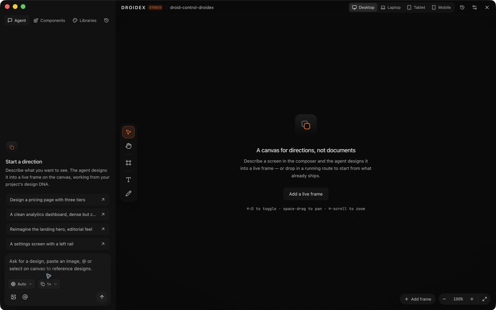
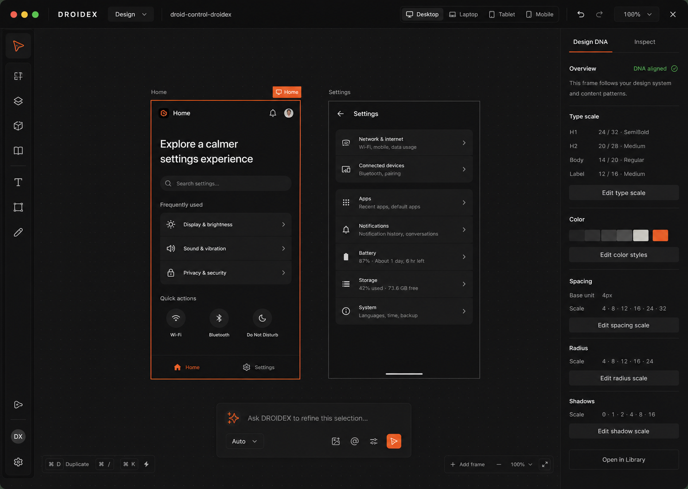
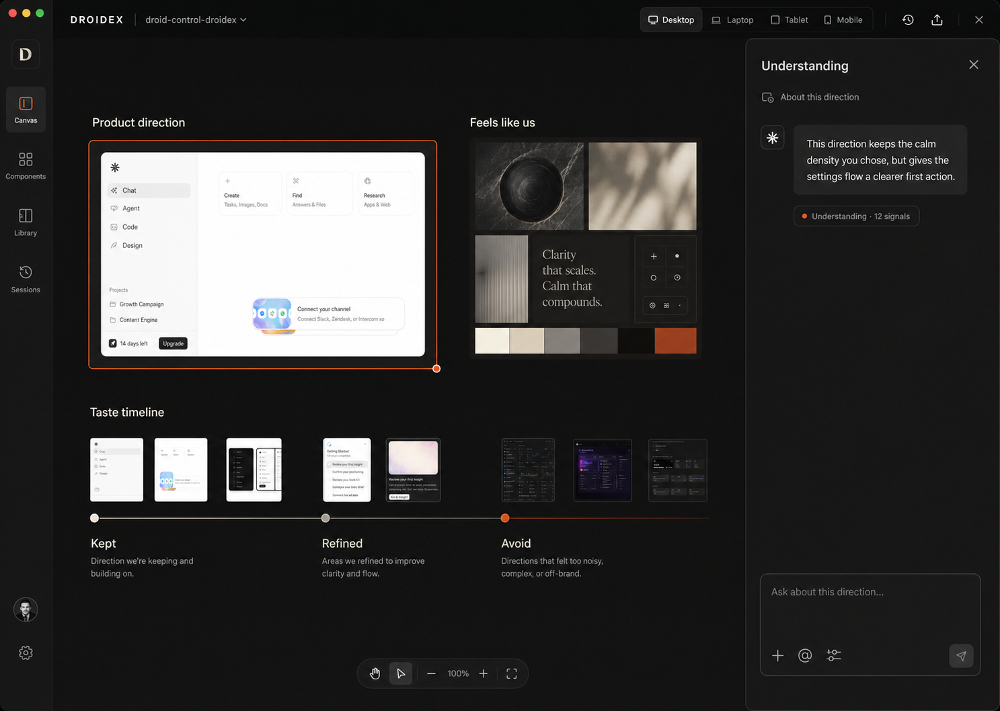
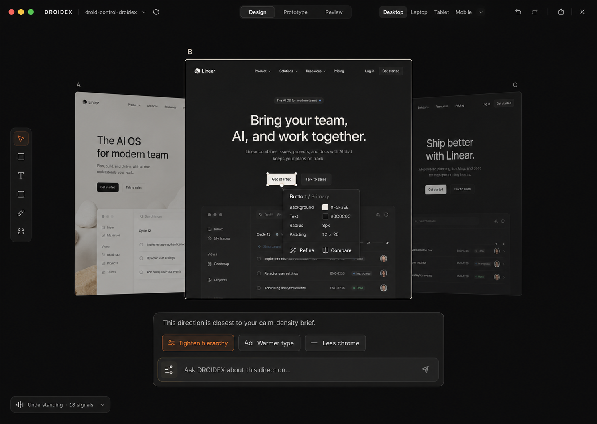

# DROIDEX Studio visual exploration

Date: 2026-07-29
Branch reviewed: `feat/droidex-design-platform`

## Scope

This exploration covers the primary desktop Design Studio workspace: canvas, agent
conversation, design DNA, component/library access, direction comparison, viewport
controls, and the first useful empty state.

The current product was opened with the
`/Users/anas/Documents/droid-control-droidex` workspace selected and captured before
the concepts were generated.

## Current-state findings

### What is already strong

- The canvas is correctly positioned as the central product surface.
- Viewport presets, the compact tool rail, live frames, and project-level DNA are
  the right primitives for a serious design workspace.
- The product thesis is differentiated: DROIDEX retains understanding and evolves
  a real codebase instead of stopping at prompt-to-screen generation.

### Structural UX risks

1. The fixed 336px agent panel takes permanent space even when the user is
   inspecting or arranging work.
2. Agent, Components, and Libraries are presented as peer tabs, but the product
   hierarchy is canvas-first; those tools should appear in context.
3. The empty state explains the product but does not demonstrate its unique
   advantage: accumulated understanding, direction history, and DNA.
4. The current left panel mixes onboarding copy, prompt suggestions, model controls,
   attachments, and the composer in one narrow column.
5. The orange selection treatment is visually loud relative to the restrained
   canvas and is repeated across controls, weakening its meaning.

### Visual and accessibility risks

- Several labels and helper lines are very small and low-contrast against nearly
  black surfaces.
- Thin dark borders do not provide enough separation between adjacent surfaces.
- Icon-only controls depend heavily on hover tooltips and should retain clear
  accessible names, keyboard focus, and at least 24px visual / 32px interactive
  targets.
- Dark-mode contrast, focus order, zoom/reflow, reduced motion, and screen-reader
  labels still require implementation-level testing; screenshots cannot confirm
  them.

## Research synthesis

The useful pattern across current design tools is not “more AI chrome.” It is a
shared canvas where the current selection becomes context:

- [MagicPath Canvas](https://www.magicpath.ai/documentation/features/canvas)
  treats selected designs, sketches, shapes, and images as the context for the next
  chat turn.
- [MagicPath introduction](https://www.magicpath.ai/documentation) positions
  designs, agents, references, and collaborators as objects on one canvas.
- [Figma Make](https://developers.figma.com/docs/code/intro-to-figma-make/) makes
  chat central while allowing design-system packages to ground generated work.
- [Paper](https://paper.design/) differentiates with a real HTML/CSS canvas, keeping
  the rendered design close to shippable code.
- [Claude Artifacts](https://support.anthropic.com/en/articles/9487310-what-are-artifacts-and-how-do-i-use-them)
  uses a dedicated preview beside conversation, reinforcing the value of a stable
  work surface rather than inline chat output.

For DROIDEX, the opportunity is to combine those interaction lessons with what the
competitors do not own: a visible understanding history, repo-resident design DNA,
and continuous work on the real product.

## Direction principles

- Canvas first; conversation appears near the selected work.
- Understanding is a visible product object, not hidden model context.
- Direction comparison should be spatial and immediate.
- Use spacing, scale, typography, and alignment before borders or elevation.
- Keep one warm accent for the current selection or primary action.
- Treat dark mode as warm graphite and bone-white, not blue-black plus neon.
- Reveal complexity progressively: rail, contextual dock, contextual inspector.

## Generated concepts

### Quiet Canvas

Generation brief: preserve the existing Studio anatomy, collapse navigation to a
narrow rail, make two live frames the hero, move the agent composer onto the canvas,
and expose selected-frame DNA in a calm right inspector.

### Living Studio Wall

Generation brief: make the accumulated understanding tangible through a product
direction, mood specimen, and taste timeline on the canvas, with a contextual
conversation drawer for the selected direction.

### Contextual Stage

Generation brief: remove permanent panels, fan three live directions across the
canvas, attach component controls to the selected element, and combine critique,
refinement actions, and prompting in one floating dock.
