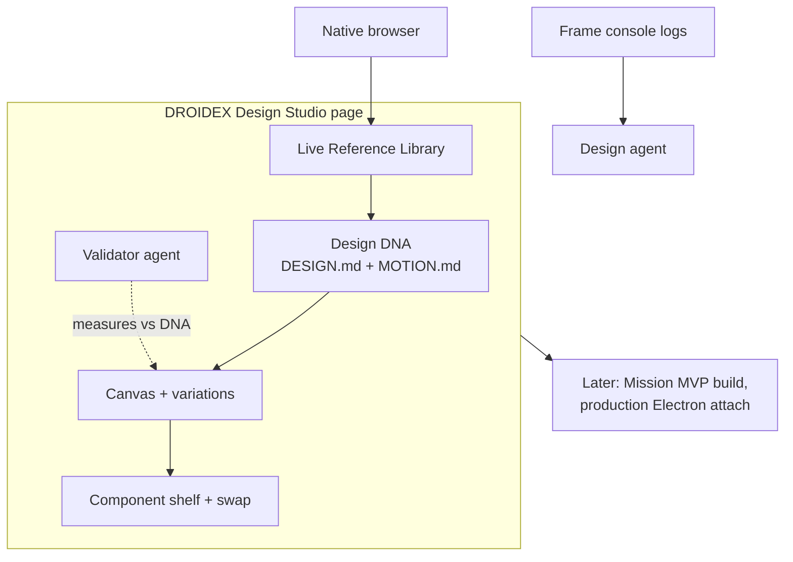

# DROIDEX design platform roadmap

Status: execution roadmap, July 2026. This is the plan the team and agents follow. The product definition (what DROIDEX is and why each piece exists) lives in `docs/droidex-product-vision.md`; where the two disagree, the vision wins on direction and this document wins on sequencing and mechanics. The original Phase 1-5 plan is built or absorbed; see "Current build state" below.

## Positioning

DROIDEX is a design practice, not a design generator (see the vision doc's thesis). It turns Droid Control into a design platform for people who ship real products: local-first, repo-anchored, context-aware over time, and enforced by quiet measurement rather than taste claims.

The core thesis: understanding and design decisions must live in repo artifacts (`UNDERSTANDING.md`, `DESIGN.md`, `MOTION.md`, a component registry), be readable by any model the user chooses to work with, and be enforced by measurement of rendered output running backstage. Everything runs on the user's actual codebase, their running dev server, and a real browser. No cloud sandbox, no credit meter, no export step that loses the mapping back to source, and no model lock-in: the workspace supplies the memory, the user supplies the model.



What already exists in this repo and makes the plan credible rather than aspirational:

- A native browser pane with design mode: element, region, and text selection with cropped screenshots (`electron/nativeBrowserPreload.cjs`, `src/lib/iframeDesignMode.ts`).
- Source mapping from rendered elements to `file:line` via React fiber `_debugSource`, data attributes, and Vue/Svelte metadata (`ElementSource` in `sidecar/src/protocol.ts`, resolved in `electron/nativeBrowserPreload.cjs`).
- Structured design prompts: `DesignReference` packs with computed styles, ancestors, outerHTML, and screenshots, composed by `sidecar/src/browser/designPromptPacks.ts`.
- Computed-style DOM snapshots (`sidecar/src/browser/domSnapshot.ts`) capturing color, background, font family/size/weight, border, radius, display, position, opacity, and transform per element.
- A browser MCP server exposing twelve tools to agents (`sidecar/src/browser/browserMcpServer.ts`), including `design-mode` and `design_reference`.
- Viewport presets for desktop, laptop, tablet, and mobile (`VIEWPORT_PRESETS` in `sidecar/src/browser/BrowserSessionManager.ts`).
- A git operations layer (`electron/git.cjs`) with per-turn baselines, branch, worktree, stage, commit, and push, plus a `gh`-backed PR layer (`electron/github.cjs`).

## Competitive analysis

Four products define the current field. Each validates part of the thesis and falls short on the rest. Sources are from April to June 2026.

### Claude Design (Anthropic)

Launched April 17, 2026 as an Anthropic Labs research preview: a browser workspace at claude.ai/design that generates designs, prototypes, and landing pages, with design-system ingestion from codebases and design files.

Where it falls short:

- Fully cloud-hosted. Artifacts live in Anthropic's environment, and implementation requires a separate handoff bundle to Claude Code. It never touches your running app.
- Shares usage limits with regular Claude. Users reported that a single design-system upload exhausted a week of Pro limits in 15 minutes (r/Anthropic, April 2026), and heavy design use cannibalizes coding capacity on the same subscription (r/ClaudeAI, May 2026).
- Output is a prototype artifact, not a change to your product. Moving to production is the documented open problem.

### MagicPath 2.0

An infinite-canvas AI design tool repositioned in May 2026 around parallel agents building screens against a shared design system, with connectors to Claude Code, Codex, and Cursor.

Where it falls short:

- Credit pricing that punishes iteration: two screens cost 10 credits, a single navbar fix cost 5, and credits do not roll over (Banani hands-on review, 2026). Pro is $21 to $30 per month for 600 credits.
- Consistency failures inside a single project: a reviewed session produced two screens with two different bottom navigation bars.
- Export is React-only, generation runs took about 2 minutes each, and the claimed two-way codebase sync is unverified in practice.

### Cursor Design Mode

A visual editing mode in Cursor's built-in browser, shipped December 2025 and expanded in June 2026 with drawing, voice, and multi-select. Local-first: it edits your locally running dev server, which is the correct execution model and the closest competitor to this roadmap.

Where it falls short:

- Token drift. The manual controls attempt to map edits to existing CSS variables and tokens but "often miss or default to raw values" (Builder.io analysis, December 2025). Teams using Figma MCP plus Cursor documented agents hardcoding values instead of using their tokens (Medium post-mortem, January 2026).
- Source mapping is agentic search over injected element context, not a resolved anchor. The documented failure modes are hardcoded state-dependent styles and duplicate components: "five slightly different versions of the same component."
- No enforcement loop. Nothing measures the result against a design system after the agent runs.

### Figma Make and the Figma agent

Prompt-to-app generation with team library support, plus an MCP server that lets coding agents read Figma design context. At Config 2026 Figma added Motion, code layers, and agent skills.

Where it falls short:

- Sandbox-bound by default. Standard Make sessions run against Figma's hosted environment; downloaded code historically lacked even a runnable scaffold (Figma Forum, 2025).
- Credit metering with real backlash. Enforcement went live March 18, 2026 and forum threads called it something that "would greatly undermine Figma Make."
- The local-codebase answer exists but is gated: closed beta, waitlist, Mac-only, beta desktop app only, per-repo engineer setup, GitHub-only PR creation (Figma Help Center, May 2026). Figma validating the local thesis while gating it this hard is the opening.

### The gap

Nobody combines all four properties: local execution on the real app, deterministic source anchors from pixel to `file:line`, a design system that lives in the repo and gets injected into every prompt, and a validator that measures output instead of trusting it. Cursor has the first, partially the second, and neither of the last two. Claude Design and Figma have design-system ingestion but run in the cloud behind meters. DROIDEX builds the intersection.

## Demand evidence

- Lovable reached $400M ARR at a $6.6B valuation by March 2026; Cursor passed $2B ARR. Prompt-to-UI demand is settled. The fight is over where it runs and whether output survives contact with a real codebase.
- Recurring user requests to point cloud builders at existing repos (r/lovable, March 2026) rather than greenfield sandboxes.
- Figma's biggest 2026 Make investment is "Make in your local codebase" (real repo, real data, PRs), a direct concession that sandbox prototypes were not enough.
- Onlook, an open-source visual editor for local React apps, front-paged Show HN; superdesign.dev ships a design agent inside the IDE. Both signal appetite for local, repo-native design tooling.
- Consistency is the named pain: "Without a design system and design tokens, every AI output pulls your product in a different direction" (Boldare, April 2026). A consulting cleanup economy has formed around fixing AI-generated apps (r/ExperiencedDevs thread, 404 upvotes, April 2026).
- Credit metering frustration is documented for both Figma Make and Claude Design. Local tools bounded by the user's own agent subscription avoid the whole category of complaint.

## Current build state (July 2026)

The earlier Phase 1-5 plan in this document is built or absorbed. What exists today, with the seams the next phases plug into:

- **DNA artifact layer.** `DESIGN.md` + `MOTION.md` read/write/scan (`sidecar/src/design/dnaFiles.ts`, `dnaScan.ts`), fenced `design-tokens` JSON parsing (`tokens.ts`: `TOKEN_BLOCK`, `normalizeTokens`, `nearestPaletteColor`, `nearestScaleValue`), curated libraries (`dnaLibraries.ts`), saved directions (`savedDna.ts`), brand book rendering (`brandBook.ts`).
- **MCP surface.** `designMcpServer.ts` (server `droidex-design`): `design_dna`, `design_guidelines`, `design_system`, `design_component_registry`, `design_prototypes`, `design_preview`, `design_reference_library`. One-line DNA pointer injected per session via `withDesignDnaPointer` in `DesignManager.ts`.
- **Studio.** Top-level Studio page (`src/components/studio/`: StudioShell, StudioCanvas, StudioFrameBody, composer with model/reasoning pickers, thread history, DnaShelf) plus the design tabs (`src/components/design/`). Intake interview and N-direction authoring flow (`designBrief.ts`, `interviewQuestions.ts`, `authoringInstruction`).
- **Isolation.** Every studio session works in a git worktree on branch `droidex/design` (`isolatedWorkspace.ts`); the live tree is never touched; merge is the user's act.
- **Preview plumbing.** Loopback-only, path-confined static preview server (`previewServer.ts`, MAX_FRAMES=24, in-place frame reload); single-component esbuild stage (`componentPreview.ts`); component registry scan (`registryScan.ts`).
- **Validator core.** Rules for off-palette color, off-scale font/radius/spacing, unknown font family (`validator/audit.ts`), runner over pages x viewports (`validator/runner.ts`), collection via `auditEntryFor()` in `electron/nativeBrowserPreload.cjs`, config + Studio tab.
- **References.** Browser-captured reference library with computed styles and screenshots (`referenceLibrary.ts`, `referenceExtract.ts`).
- **Durable canvas context.** Revisioned per-thread canvas documents survive app restarts; frames, drawings, and pasted image placements are persisted without base64 or runtime state (`canvasDocument.ts`, `CanvasDocumentManager.ts`). Moodboard/inspiration/reference images resolve through bounded library IDs and can be attached to an agent turn.
- **Shared session delivery.** Main chat and Studio use the same prompt-delivery/composer semantics. Active-turn steering uses the SDK's safe-boundary send, Stop owns interruption, and automatic compaction is provider-owned through `compactionThresholdCheckEnabled`: it reacts to `compacting_conversation` / `session_compacted` in place without changing provider identity or injecting a recap prompt.

Known gaps this roadmap exists to close:

- Component previews render bare (`createElement(Component)`, no props/providers) and skip Tailwind CSS, so most real components render broken or naked.
- `MOTION.md` is freeform prose: never parsed, never measured. The audit collector captures 6 static style keys and zero transition/animation properties.
- The validator is a user-operated tab, not a loop.
- No discovery beyond the one-time intake; no durable understanding artifact; taste signals (picks, rejections, reasons) are not recorded anywhere.
- The canvas has no authoritative, event-driven working state between prompt acceptance and the first preview. A build can look frozen, an empty restore overlay can linger, and preview arrival does not yet complete a stable working-frame -> rendered-frame handoff.
- Studio trust and finish need a dedicated stabilization gate: model/repo/control truth, drawing selection ergonomics, visual-reference attachment integrity, embedded-browser recovery, popover layering, concise naming, and explicit diagnostics for stalled preview creation.
- **Tokens are single-theme.** `DesignTokens.colors` is one flat map; light/dark exists only as prose policy. There is no live theme toggle for previews or the brand book, curated libraries ship one theme each, and the validator would flag a correct dark theme as off-palette against light tokens.
- The validator's `runAfterDesignPrompt` config toggle is dead code: persisted and shown in the tab UI, but nothing consumes it (superseded by the Phase D post-turn gate; remove it there).
- Validator coverage is narrow: six computed properties, `paddingTop`-only spacing, first-corner radius, no border/shadow/gradient/line-height checks; reports are in-memory only and require the native browser runtime.
- The intake directions pick is purely conversational; the UI never records which direction the user chose.

## Engineering ground rules (apply to every phase)

1. **Artifacts before features.** Anything the agent must respect ships first as a parseable repo artifact (fenced block + parser + type), then as an MCP tool, then as UI. Prose is for humans; fenced blocks are the contract.
2. **Deterministic where possible, agentic where necessary.** Measurement, parsing, capture, and diffing are plain code with unit tests. The agent is used for judgment: synthesis, critique, refactors. Never ask a model to do something `tokens.ts` can compute.
3. **Protocol changes are dual edits.** Every new command/event lands in both `sidecar/src/protocol.ts` and `src/types/bridge.ts`, with a typed wrapper in `src/lib/commands.ts` and dispatch in `DesignManager.ts`'s command switch. No untyped payloads.
4. **The worktree is the blast radius.** All agent writes happen in the `droidex/design` worktree. New features never write to the live tree.
5. **Model-agnostic by construction.** No feature may depend on a specific model. Context flows through artifacts (`UNDERSTANDING.md`, DNA files, MCP tools) that any session on any model reads. The user picks and changes models; the workspace supplies the memory.
6. **Every phase ships with tests** following the existing `node:test` pattern (`*.test.ts` next to the module, see `savedDna.test.ts`, `audit.test.ts`) and passes the full local gate in AGENTS.md.
7. **MCP tools are contextual and lean.** Every tool answers "what does the agent need *right now*" and returns a compact digest by default: hard character caps, summaries over dumps, detail only via explicit parameters (`detail: 'full'`, an id, a range). Never return whole files, full logs, or unbounded lists; paginate or top-N everything. A tool that bloats the context is a bug even when its answer is correct. New tools ship with a stated size budget in their description and a test asserting the cap.
8. **Show, then say.** Agent-facing guidelines require visual-first behavior: when a proposal or question can be rendered, it is rendered, with text as caption. Every visual probe has a typed-answer equivalent; no flow may be pick-only. Artifacts the agent produces default to a visual form on the canvas (rendered specimen, live frame, before/after spread); raw code or markdown is the storage format, never the presentation.
9. **Small files, no god components, session-attached.** Our own code follows what we preach to agents: single-responsibility modules aiming under ~500 lines, UI split into small composable components (no god components like a monolithic canvas), shared logic extracted rather than duplicated. Every preview server, frame, and artifact is owned by and attached to a session lifecycle: created with it, restored with it, cleaned up with it. Reuse existing machinery before adding new.
10. **The canvas is a product surface with a performance budget.** Canvas interactions (pan, zoom, frame drag, selection) must stay at 60fps with 24 live frames: virtualize offscreen frames (pause/unmount iframes outside the viewport), throttle reloads, and never do layout work in React render paths that per-frame CSS transforms can do. Navigation must be learnable in one session: consistent zoom-to-fit, frame focus, and keyboard panning. Any canvas PR that regresses interaction smoothness does not merge.
11. **MCP guides, never railroads.** Tools inform the agent (tokens, understanding, registry, canvas state) and record what happened; they must not force a house style or a fixed procedure. Taste comes from the user's own understanding file and signals, so output reflects *this* user, not our defaults. The test for any new tool or guideline: a strong agent with a strong opinion and a user's context should never feel fenced in by it, and slop should be caught by measurement (audits, critique passes), not prevented by rigid templates.

## Execution phases

Ordering follows the vision's priorities. A and B are independent and can run in parallel. C depends on B (the workbench is the motion instrument). D depends on C's tokens. E depends on A. F and G are progressive and can start as spikes early.

### Phase A: UNDERSTANDING.md and the Discovery Engine

**What.** The durable client-understanding artifact and the adaptive, ongoing discovery practice that fills it (vision Pillars 1-2).

**Approach.** The understanding is a repo artifact with a machine-readable core, exactly like DESIGN.md. Discovery is not a wizard: it is a posture, implemented as (a) a question-bank module, (b) an MCP tool the agent uses to read gaps and record signals, and (c) rendered probes reusing the existing directions flow.

**How.**

1. `sidecar/src/design/understanding.ts`: extend the `dnaFiles.ts` kind union to `'design' | 'motion' | 'understanding'` (`UNDERSTANDING_FILE = 'UNDERSTANDING.md'`) so read/write/size-cap/worktree-seeding come free (`isolatedWorkspace.ts` seed list gains the file). Structure: prose sections (Audience, Goals, Emotional targets, Never-do, Decisions) plus two fenced blocks parsed by a new `parseUnderstanding()`:
   - ```` ```understanding ```` JSON: `{ audience, goals, emotionalTargets: {evoke: [], avoid: []}, neverDo: [], openQuestions: [] }`.
   - ```` ```taste-signals ```` JSON lines, append-only log: `{ at, kind: 'pick'|'reject'|'probe'|'answer', subject, scope, strength: 'principle'|'decision'|'leaning', reason, evidence }`. Appends are programmatic (a `appendTasteSignal()` helper), never agent free-writes, so the log stays parseable. Taste is recorded as timestamped, scoped observations, never facts: the digest computes the *current stance* per subject deterministically (principles never decay and contradiction triggers a question; decisions carry scope so "rejected orange on the hero" and "wants orange as accent" coexist; leanings are recency-weighted). Nothing becomes a hard rule unless promoted to the never-do list.
2. **Question bank.** Evolve `src/components/studio/interviewQuestions.ts` into `sidecar/src/design/discoveryBank.ts`: a typed bank of ~60 questions across the seven discovery domains (brand strategy, audience reality, business goals, competitive positioning, content truth, constraints, emotional targets), each tagged with `domain`, `dependsOn` (branching), and `fillsGap` (which understanding field it populates). Gap detection is deterministic: `openGaps(understanding)` returns unfilled fields; the agent chooses *which* gap to raise and *how* to phrase it, the bank guarantees coverage.
3. **MCP tool.** Add `design_understanding` to `designMcpServer.ts`: returns parsed understanding + `openGaps` + the last N taste signals; a `record_signal` action wraps `appendTasteSignal`. Extend `withDesignDnaPointer` to mention `UNDERSTANDING.md` first.
4. **Rendered probes.** Reuse the existing N-direction authoring flow (`authoringInstruction`): a probe is a 2-frame direction spread where the composer renders a "which feels more like you, and why?" affordance; the pick + the typed why are recorded as a `probe` signal. No new canvas machinery.
5. **Ongoing discovery.** Guidelines (`guidelines.ts`) gain one rule: at the start of any new design task, consult `design_understanding`; if the task touches an open gap, ask before generating. Contradiction surfacing is deterministic: when a new signal conflicts with an `understanding` field, the agent is instructed to raise it, not overwrite.
6. **Question craft in guidelines.** One question at a time, earned by an open gap; show-then-say (render two interpretations rather than asking the user to imagine); every probe has a typed-answer path, and typed taste gets a rendered "this is what I heard" confirmation that is optional, never a forced pick; always capture the why and quote it.
7. **Shipped direction gallery.** Expand the four `dnaLibraries.ts` entries with 12-16 bundled static direction specimens (brutalist, enterprise-dense, warm consumer, luxury, playful, data-heavy, ...), same asset pattern as the libraries: a new user with an empty repo sees a rich starting fan in under a second, zero model invocations. Greenfield flow: discovery first, fan pick, then a scaffold born design-ready (tokens + theme seam + registry conventions from the first commit).
8. **Workspace-wide pointer.** Extend the DNA pointer injection so *every* session in the workspace (not only Studio sessions) receives the `UNDERSTANDING.md` reference; backend agents read the same product understanding. Enforcement/canvas layers stay design-scoped.
9. **The Understanding Wall + taste timeline (UI).** A canvas board rendered from the parsed understanding: emotional targets as rendered specimen pairs, kept directions as thumbnails, never-do list as crossed-out examples; the signal log as a scrubable thumbnail strip showing how the direction evolved. Both are read-only views over the artifacts (the markdown is the database, the canvas is the interface), so they are pure composer/canvas work with no new protocol beyond a `design.understanding.read` command.

**Acceptance.** Start a fresh session on a different model: the agent references prior decisions and taste signals without re-asking answered questions, and raises exactly the unfilled gaps. A recorded contradiction ("rejected orange on hero" then "wants orange accent") yields a scoped digest, not an overwrite. `understanding.test.ts` covers parse/append/scope/gap logic.

### Phase B: Component Workbench (make previews genuinely useful)

**What.** Every registry component renders styled, interactive, and grounded in real usage: a Storybook that writes itself (vision Pillar 4).

**Approach.** Fix the CSS pipeline deterministically first (biggest win, no agent involved), then let the agent synthesize stage harnesses only where bare rendering fails, cached in the repo so synthesis happens once per component.

**How.**

1. **Tailwind/real CSS pipeline** in `componentPreview.ts`: stop filtering `@tailwind` files. Detect the project's Tailwind major from its `package.json`. v4: compile via the project's own `@tailwindcss/postcss` / `@tailwindcss/node` (resolved with the existing `createRequire(cwd)` pattern used by `loadEsbuild`). v3: run the project's PostCSS with its `tailwind.config.*`, overriding `content` to the component's import graph, which esbuild's `metafile` already yields from the same build. Emit `bundle.css` into the stage dir (the stage HTML already links it).
2. **Stage harness convention.** `.droidex/stages/<Component>.stage.tsx` in the worktree, exporting `{ component, providers?, presets: Record<string, object> }`. `buildComponentPreview` prefers the stage file when present; the bare path stays as the fallback.
3. **Harness synthesis (agent).** Extend `registryScan.ts` to also record call sites: for each exported component, the files/lines where it is rendered plus literal props at each site (a TS AST pass, same scanner infrastructure). Expose as `usages` on `design_component_registry`. When a bare preview errors (the stage already reports `stage-error`), the sidecar queues a synthesis task: the agent reads the component + `usages` and writes the stage harness with realistic props per call site (each becomes a named preset: "as used in Sidebar"), required providers, mock handlers. One synthesis per component, committed to the worktree.
4. **Stage page upgrades** in the `stageHtml` template: preset picker (tabs from `presets` keys), knobs auto-generated from registry prop types (enum -> dropdown, boolean -> toggle, string -> input), and a **state matrix** mode rendering default/hover/focus/disabled/loading simultaneously (pseudo-states forced via injected classes, prop states via preset overrides).
5. **New command** `design.component.stage` (protocol dual-edit per ground rule 3) to trigger synthesis explicitly from the Components tab.

**Acceptance.** On this repo and one external Tailwind repo: >80% of registry components render styled; components with call sites show usage presets; state matrix renders for interactive components. `componentPreview.test.ts` extended for the CSS pipeline and stage-file preference.

### Phase C: Motion reality

**What.** `MOTION.md` becomes parseable, measured against what the codebase actually does, retrofittable via the motion pass, and tweakable via the scrubber (vision Pillar 4).

**Approach.** Same pattern as color tokens: fence -> parser -> capture -> deterministic audit -> agent only for the fixes. The workbench (Phase B) is the measurement instrument because motion only exists during interaction, and the stage owns the component and can drive it.

**How.**

1. **`motion-tokens` fence.** `tokens.ts` gains `MOTION_BLOCK` regex + `parseMotionTokens()`; `types.ts` gains `MotionTokens { durations: Record<string,[min,max]|number>, easings: Record<string,string>, pressScale?, reducedMotion: 'disable'|'reduce' }`. `dnaScan.defaultMotionMarkdown()` and `dnaLibraries.renderMotion()` emit the fence alongside their prose. `design_dna` returns parsed `motionTokens`; `design_system` gains motion lookup (nearest duration token, easing by name), mirroring the existing palette lookup.
2. **Capture.** Two collectors:
   - Static: `auditEntryFor()` in `electron/nativeBrowserPreload.cjs` adds `transitionDuration`, `transitionTimingFunction`, `animationDuration`, `animationName` to its style keys (and the shared key list flagged in the old open question 4 gets extracted now: one `AUDIT_STYLE_KEYS` module consumed by preload, `iframeDesignMode.ts`, and `domSnapshot.ts`).
   - Dynamic: the workbench stage gains a driver script that programmatically fires hover/focus/press/mount on the mounted component, then reports `document.getAnimations()` (exact duration, easing, keyframes per animation, no shorthand parsing) back via `postMessage`; `previewServer.ts` gains a loopback collection endpoint the stage posts to.
3. **Motion inventory.** New `sidecar/src/design/motionInventory.ts`: sweeps the registry through the workbench driver (components) and configured pages through the browser path, producing per-component/per-page `MotionRecord[]`. Deterministic classifications: `off-token-duration`, `unknown-easing`, `dead-interaction` (element the registry marks interactive, or with an interactive ARIA role, that produces zero animations across all triggers), `reduced-motion-violation` (same sweep re-run with the reduced-motion media emulated; anything still animating is flagged). New command `design.motion.inventory`.
4. **Audit rules.** `validator/audit.ts` gains `checkMotion()`; `FindingRule` union extends with the four rules above. Unit tests alongside `audit.test.ts`.
5. **The motion pass (agent).** An agent task template consuming the inventory: fix off-token timings, add DNA motion to dead interactions, honor reduced motion. Every change previewed as before/after state-matrix frames in the workbench; approval is visual, per component.
6. **Motion scrubber (UI).** In a canvas frame, selecting an element surfaces its animations via the Web Animations API (`element.getAnimations()`, scrub with `currentTime`/`playbackRate`, live-edit easing via `KeyframeEffect.updateTiming`). "Apply" dispatches a scoped design prompt carrying the exact token-mapped values; the agent writes the code change in the worktree.
7. **Reconciliation.** `MOTION.md` authorship flows from reality: the inventory renders a divergence report ("DNA says micro 120-160ms; 14 components run 300ms; 9 dead interactions") in the DnaShelf, and "adopt observed" / "enforce DNA" are the two resolutions.
8. **Playable brand book.** With motion tokens parseable, the brand book frame demonstrates instead of describing: each motion rule plays live on hover at its real duration/easing (a Web Animations demo element per token), the spacing rhythm renders as a toggleable ruler overlay, and color pairs render inside real registry components (via Phase B stages), never as naked swatches.

**Acceptance.** Inventory runs across this repo's registry; parseable motion tokens round-trip; scrubber edits land as token-correct code; all four motion rules covered by tests.

### Phase D: Quiet enforcement (retire the validator tab)

**What.** Enforcement becomes a backstage loop: post-turn self-repair, write-time token mapping, canvas pins, DNA scores. The user never operates a validator (vision Pillar 4, "quiet measurement").

**Approach.** Hook the existing turn lifecycle and the existing audit; the only new intelligence is the automatic repair turn, which is just a scoped follow-up prompt with structured findings.

**How.**

1. **Post-turn gate.** In `DesignManager`, hook studio-session turn completion. Detect UI-file edits via the per-turn git baseline that `electron/git.cjs` already keeps (`markTurnStart` + diff). If UI files changed: re-render affected previews/pages, run `auditElements` (colors, type, spacing, radii, plus Phase C motion), and if findings exist, dispatch an automatic repair turn carrying the structured findings (capped at 2 rounds, then surface remainder). Emit a new `ServerEvent` (`design.enforcement.result`) so the composer shows the badge: "DNA: 4 auto-fixed, 0 remaining."
2. **Write-time layer.** A worktree file watcher in the sidecar (scoped to the isolated worktree only): on save of changed source files, a static pass maps raw hex/px/ms literals to nearest tokens via the existing `nearestPaletteColor`/`nearestScaleValue` and the Phase C motion lookup. Findings feed the same event stream; no blocking, just early signal.
3. **Pins.** `ValidatorFinding` already carries element box coordinates; `StudioFrameBody` renders findings as overlay pins on the frame with a per-pin "fix" that dispatches a scoped prompt anchored to the finding's `file:line`.
4. **Scores.** DNA score per component (1 minus violation density from the last sweep) shown in the Components tab and the shelf; per-page score on canvas frames.
5. **Theme-aware audit.** With Track T's two-theme tokens landed, sweeps run per theme: the page/preview is audited once per theme (toggled via the Track T mechanism) and compared against that theme's palette, so a correct dark theme never flags against light tokens.
6. **Retire the tab, delete the dead toggle.** `ValidatorTab` demotes to an advanced-config surface (page scope, allowlist, triggers); the never-consumed `runAfterDesignPrompt` config flag is removed, since the post-turn gate replaces it. No user-facing "run validator" as a primary action. Broaden coverage while here: all four padding/margin sides, all radius corners, border colors, and shadows against the token lists.

**Acceptance.** An intentionally off-DNA agent edit gets auto-repaired before the user sees it, with the badge reflecting the rounds; pins render at correct coordinates; scores update after sweeps.

### Phase E: The Taste Engine

**What.** Cheap models produce tasteful output through constrained choice, best-of-N with visual self-critique, and a personal taste profile (vision Pillar 5). References become dated, decaying hypotheses (Pillar 3).

**Approach.** Never "prompt harder." Shrink the decision space with a structured moves corpus, let selection do what generation cannot, and condition everything on `UNDERSTANDING.md`.

**How.**

1. **Moves corpus.** `referenceExtract.ts` output distills into `.droidex/moves/*.json`: typed recipes (`kind: 'type-pairing'|'spacing-rhythm'|'hero-composition'|'nav-pattern'|...`, concrete values, provenance reference id, `capturedAt`, resonance tags from taste signals). Distillation is an agent task over the captured styles; the schema and storage are deterministic. New MCP tool `design_moves` deals a filtered hand (matching the understanding's emotional targets, biased by the taste profile) instead of the full corpus.
2. **Best-of-N with critique.** The directions flow already renders N variants. Add the selection pass: screenshot each frame (preview server + existing capture), one vision-critique call against a fixed short rubric (hierarchy, rhythm, contrast, restraint, DNA adherence, the deterministic audit score folded in), rank, and fan the survivors. The rubric lives in `guidelines.ts` territory: versioned text, not per-session improvisation.
3. **Taste profile.** Every pick/reject/probe signal (Phase A's log) updates per-move resonance counters; a compact profile digest (top resonant moves, consistent rejections with reasons) is computed deterministically and served through `design_understanding`, so any model on any session generates through the user's accumulated taste.
4. **Reference decay.** `referenceLibrary.ts` entries carry `capturedAt` and resonance annotations ("landed in March for its type rhythm, not its color"); the digest downweights stale, uncorroborated references. `UNDERSTANDING.md` always outranks the library; contradictions annotate the reference rather than being hidden.

**Acceptance.** A/B on a cheap model: directions generated with moves + critique + profile visibly beat unconstrained generation on the same brief (panel-judged on 10 briefs). Profile digest changes measurably after 20 recorded signals.

### Phase F: The universal canvas (web -> Electron -> iOS)

**What.** The canvas hosts the actual running product, not specimens (vision Pillar 4).

**How.**

1. **Web (now).** Durable per-thread canvas persistence is built. The remaining web slice is canvas frames pointing at the worktree dev server with per-frame viewport presets; `attachIframeDesignMode` per frame for selection; source anchors via the existing `resolveSource` chain; and multi-viewport spreads of the same live page.
2. **Electron (next).** Reuse the droid-control Electron-driving machinery: the embedded frame is a screenshot stream + forwarded input for the target app's window, rendered as a canvas frame. Design-mode selection maps through the same preload anchors when the target is a dev build; production builds degrade to region selection + screenshots until production source mapping lands.
3. **iOS (spike first, stand on existing MCPs).** Do not build simulator plumbing from scratch: mature MCP servers already drive the iOS Simulator (`ios-simulator-mcp`, `mobile-mcp`, XcodeBuild MCP: boot, install, screenshot, tap/swipe, describe UI via accessibility). The spike wires one of them into the studio session as an external MCP server, and the canvas frame renders its screenshot stream (`simctl io` polling for v0, the recording pipe for v1) with touch injection mapped through the same tools. The agent edits SwiftUI in the worktree with hot reload (SwiftUI previews / Inject). Timebox a one-week spike to validate frame rate and input latency before committing; the exit artifact is a demo of the agent changing a SwiftUI view and the canvas frame updating.
4. **Build presence (next).** Existing prompt, working-state, and `design.preview` events first drive a transient `accepted | working | opening_preview` model. A separate producer contract may refine `working` into tool-backed `editing_code | building_preview | rendering_preview` only when the corresponding operation actually starts. The first working event materializes one named frame, with a theme-semantic activity accent, while the canvas stays pannable. No fake percentages or timer-authored phases; reduced motion receives an opacity handoff instead of travel.
5. **In-place preview handoff.** The first valid `design.preview` replaces the working shell without changing frame identity or camera position. Keep the shell painted until the first preview paint, then select/reveal the finished artifact exactly once. Updates preserve the user's camera and selection; Stop/failure clears activity with an actionable status.

**Acceptance (web slice).** Two viewports of the real app live on the canvas, element selection resolves to `file:line`, and layout survives app restart. A design turn responds visibly within 250ms of its owning event, keeps one stable frame through build and preview, never persists transient activity, and opens the rendered artifact automatically without a blank intermediate canvas.

### Phase G: The design-readiness pass (production-repo onboarding)

**What.** Any production repo (including old Electron apps) becomes designable: tokens extracted, theme seam installed, duplicated UI componentized (vision Pillar 4).

**How.**

1. **Deterministic audit first.** A readiness scan combining `dnaScan` (existing token sources), `registryScan`, and a static sweep for raw hex/px/ms literals and duplicated JSX structures. Output: `.droidex/readiness.md` report with a score and a ranked refactor plan.
2. **Agent execution in stages.** Each plan item (extract values to tokens -> install theme seam -> componentize duplicates) is a bounded agent task in the worktree, previewed before/after in the workbench, committed separately for one-click revert (the `git.cjs` per-turn baseline pattern).
3. **Funnel placement.** The pass is offered when a project first opens the Studio and its readiness score is low; it is the onboarding, not a settings feature.

**Acceptance.** Run against one legacy repo: readiness score improves measurably, app still builds and passes its own tests after each stage.

### Phase H: The inhabited canvas (the agent uses what it builds)

**What.** The agent becomes a presence on the canvas: one selection language across DOM and canvas, lean canvas-control tools, its own cursor, self-review by recording, walkthrough videos as deliverables, video references as input, and errors delivered as context (vision Pillar 6).

**Approach.** Everything here composes existing machinery: the design-mode injection, the browser-session recording pipeline, the preview server, and the worktree. The new intelligence is behavioral (guidelines + two agent task templates); the new engineering is a shared selection module, a small canvas-control protocol surface, and frame instrumentation. Every tool obeys ground rule 7: digests, not dumps.

**How.**

1. **Unified selection.** Extract the element-picking and annotation logic shared by `iframeDesignMode.ts` and the native-browser preload into one `sidecar/src/design/selection/` module with a single resolved-selection shape: `{ element, role, computedStyleDigest, fileLine, frameId, annotation? }`. Canvas frames, the workbench stage, the brand book, and the browser pane all attach the same picker. A user annotation ("tighter") *is* a prompt: the composer dispatches it with the resolved selection attached, and the same shape is what agent tools receive, so user gestures and agent perception speak one language.
2. **Canvas state and control tools.** Two MCP tools on `designMcpServer.ts`:
   - `canvas_state`: compact inventory only: `{ frameId, title, kind: 'page'|'component'|'brandbook'|'browser', url, viewport, position, dnaScore?, errorCount? }` per frame, hard-capped, never DOM contents (selection and snapshot tools exist for depth).
   - `canvas_control`: `open | close | move | resize | focus | arrange` with typed payloads (dual protocol edits per ground rule 3, dispatched through `DesignManager`). The agent composes its own workspace: a before/after pair for review, a fan for a probe, a motion strip for a sweep. Layout mutations render animated so the user sees the agent arranging, not teleporting frames.
3. **The agent cursor.** A visually distinct second cursor rendered by the composer (canvas overlay, never the OS cursor: the user keeps control of their machine). Agent pointer tools (`cursor_move`, `cursor_click`, `cursor_hover`, `cursor_scroll`, `cursor_type`) resolve targets through the unified selection shape (element or coordinates within a frame) and drive the frame via the same synthetic-event injection the Phase C motion driver uses; the cursor overlay animates to the target before the event fires so the user can watch. Rate-limited and scoped to canvas frames only.
4. **Self-review by recording.** An agent task template: after building, walk the changed surfaces with the cursor (the Phase C driver's trigger list plus the task's own acceptance points) while the session records via the existing browser-session recording pipeline (`BrowserSessionManager` capture lifecycle). The review pass then consumes sampled keyframes from the recording plus the `document.getAnimations()` inventory: the agent *sees* the hover that never fired, the transition that stutters, the layout jump. Findings feed the same repair loop as Phase D, before handover.
5. **The walkthrough deliverable.** The same recording, kept: turns that build UI end with a short walkthrough video (agent cursor navigating the result) attached to the turn output next to the diff. This is the local version of the cloud-agent "sends you a video" workflow: assign work, come back, watch the agent use what it built on your own machine.
6. **Video as input.** Accept video files (and screen recordings) as references: `referenceExtract.ts` gains a video path that samples frames at scene changes (ffmpeg, already feasible locally) for the visual read, and estimates motion character (durations and easing feel from frame deltas) for the motion read. Extracted moves land in the reference library dated and tagged like any capture; the agent asks the one why-question ("what resonated in this clip?") and logs the answer as a signal. Size/length caps enforced before processing.
7. **Error context loop.** Instrument every canvas frame and the native browser pane: injected `console`/`fetch`/`error` hooks (same injection seam as design mode) and Electron `console-message` events, normalized into structured `{ level, message, stack, fileLine (source-mapped), frameId, at }` records. Errors attach to the frame (badge + `errorCount` in `canvas_state`) and are automatically included when the agent works on that frame, so broken builds are debugged from evidence, not from the user pasting stack traces. Digest rule: last N unique errors, deduplicated, capped.

**Acceptance.** The agent, unprompted by the user: arranges a before/after spread, walks the new flow with its visible cursor, produces a walkthrough video attached to the turn, and self-catches a dead hover from its own recording. A dropped video reference yields dated moves in the library. A thrown render error reaches the agent's next turn as a source-mapped record. All new tools pass size-budget tests.

## Sequencing summary

| Order | Phase | Depends on | Parallelizable with |
|---|---|---|---|
| 1 | A: Understanding + Discovery | - | B |
| 2 | B: Component Workbench | - | A |
| 3 | C: Motion reality | B | E spike |
| 4 | D: Quiet enforcement | C (motion tokens) | E |
| 5 | E: Taste Engine | A (signals) | C, D |
| 6 | F: Universal canvas | web slice: none; Electron/iOS: spikes anytime | all |
| 7 | G: Design-readiness pass | B (workbench previews) | F |
| 8 | H: Inhabited canvas | C (driver), D (repair loop), F web slice (frames); selection unification + error loop can start with B | E, G |

The demo arc this sequencing serves: discovery that feels like an agency engagement (A) -> a component library that renders itself (B) -> motion you can see, measure, and bend (C) -> an agent that cannot hand over off-DNA work (D) -> cheap models with taste (E) -> your real product, on the canvas (F/G) -> an agent you can watch use what it built, and that sends you the video (H).

## Small-PR execution plan

All work ships as small, independently green PRs off `feat/droidex-design-platform`. Rules for every PR:

- **One seam per PR.** A PR is either sidecar logic, or a protocol dual-edit plus dispatch, or UI, never all three unless trivially small. Order within a feature: artifact/parser first, then MCP/protocol, then UI.
- **Reviewable size.** Target under ~400 changed lines excluding tests and generated files. If a step outgrows that, split it.
- **Green gate per PR.** Each PR passes the full local gate in AGENTS.md, ships its tests in the same PR, and runs `docs:generate` when scripts/env change.
- **Deterministic and agentic changes never mix.** A parser/measurement PR does not also change guidelines or task templates.
- **Local-only hacks stay local.** The `history.ts` sqlite rename (`index-droidex.sqlite`) is dev isolation for this worktree and is never committed.

### Wave 0: land the direction (landed)

| PR | Contents | Notes |
|---|---|---|
| 0 | `docs/droidex-product-vision.md` + rewritten `docs/design-roadmap.md` + regenerated reference | Landed; docs only |
| 0.1 | Component-first rule in `guidelines.ts` | Landed |

### Stabilization gate: make the current Studio trustworthy

These slices land before the feature waves resume. They are intentionally split by owner and failure seam; a row that exceeds the review-size rule splits again rather than becoming a Studio mega-PR.

Track S (correctness and finish):

| PR | Contents | Seam / acceptance |
|---|---|---|
| S0 | Provider-owned automatic compaction; delete pre-send manual compaction and synthetic recap behavior | **Landed.** Sidecar only; same provider identity; native queue/steer/Stop semantics; explicit manual Compact remains a separate user action |
| S1 | Audit, then land the current Studio visual-polish diff | Before staging, restore the removed `exportKind` selection context and add reduced-motion handling; the resulting commit is renderer visuals only: app theme, calm sans typography (mono only for code), soft rounded surfaces, restrained icons, visible focus |
| S2 | Studio chrome truth: one back action, `DROIDEX DESIGN`, repository selector beside Canvas, and truthful add-page/zoom/fit/expand controls | Renderer only; every icon has a tooltip, keyboard focus, active/disabled state, and a real command |
| S3 | Composer/model truth | Reuse the canonical composer; Auto/default resolve to and display the exact active model; send has no artificial UI delay; Stop, queue, and safe-boundary steer match main chat |
| S4a | Canvas restore state machine | A persisted canvas reopens once; an empty document never shows `Restoring canvas`; stale restore responses cannot replace the current thread |
| S4b | Transcript/reconnect state machine | Chat restore and bridge reconnect each settle once or fail actionably; no infinite connecting state and no duplicate prompt delivery |
| S5a | Visual-reference persistence and resolution | Pasted images persist, remain arrangeable/taggable, and resolve to bounded library IDs after restart; original bytes stay path-confined |
| S5b | Composer reference-chip lifecycle | One visible chip maps to those IDs in hidden agent context, stays connected to its prompt, then clears exactly once after accepted send |
| S5c | Prompt presentation integrity | Internal DNA/reference enrichment stays hidden from the transcript and one user send creates exactly one visible user message |
| S6 | Drawing/selection interaction hardening | Cancel cannot crash; select/move/resize/delete are deterministic; resize cursors match edges/corners; empty-canvas double-click exits the active creation tool; hover tooltips name every tool |
| S7 | Wireframe tools and agent handoff | Line/ruler, rectangle, ellipse, text, fill, stroke color/width, and shape options; selected drawings attach to the shared composer as a compact structured canvas context the agent can resolve |
| S8a | Embedded-browser navigation/reload recovery | External navigation, interaction, history, and reload work in a live frame; stale connecting states time out with diagnostics |
| S8b | Canvas overlay layering | History, menus, tooltips, and popovers share one overlay layer above frames and remain keyboard-dismissable |
| S9a | Canonical naming | First prompt derives a concise thread title (never generic `DESIGN`); preview metadata owns artifact/frame naming |
| S9b | Prompt-to-preview latency telemetry | Measure prompt acceptance -> provider send -> first event -> preview without changing delivery policy; report regressions in diagnostics |
| S9c | Stalled-build settlement | Tool/build failure and inactivity surface an actionable error and clear working state instead of leaving the model or canvas stuck forever |

Track P (MagicPath-quality canvas work presence, from the July 31 recording):

| PR | Contents | Depends on |
|---|---|---|
| P1 | Typed transient reducer driven only by existing events: `accepted`, `working`, `opening_preview`; transient state is never persisted | S0 |
| P1a | Typed activity-event contract and producer for actual `editing_code`, `building_preview`, and `rendering_preview` operations; protocol dual edit + producer tests, no heuristics | P1 |
| P2 | Active working frame with a theme-semantic activity accent and one cancelable 0.8-1.2s auto-fit; canvas remains interactive | P1 |
| P3 | Spatial agent presence: labeled canvas cursor and restrained fading dot field move only on meaningful activity events; accessible live text mirrors the phase | P2, P1a |
| P4 | First-paint-safe in-place preview handoff; same frame id and camera, auto-select exactly once, no blank shell | P1, P2 |
| P5 | Canonical artifact naming/restoration; preview metadata names the frame and refresh never replays working animation | P4, S4a, S9a |
| P6 | Contextual selected-frame controls and an in-place code drawer; controls stay hidden until hover/selection and never reload the preview | P4 |

The recording's state language is deliberate: green means agent activity, blue means user selection, and neutral means ready. DROIDEX uses the application theme's semantic activity and selection tokens rather than hard-coded hues. Color is reserved for state; progress is spatial and semantic, never a decorative spinner.

### Wave 1: Phase A artifact core and Phase B pipeline (parallel tracks)

Track A (understanding):

| PR | Contents | Depends on |
|---|---|---|
| A1 | `understanding.ts`: kind-union extension in `dnaFiles.ts`, `UNDERSTANDING.md` read/write/seed, `parseUnderstanding()`, `appendTasteSignal()` with the scoped signal schema, `understanding.test.ts` | - |
| A2 | `discoveryBank.ts`: typed question bank, `openGaps()`, tests | A1 |
| A3 | `design_understanding` MCP tool (read + `record_signal`), pointer mention, question-craft + show-then-say rules in `guidelines.ts` | A1, A2 |
| A4 | Probe wiring: pick + typed-why from the directions flow recorded as signals (protocol dual edit + composer affordance) | A3 |
| A5 | Workspace-wide pointer: `UNDERSTANDING.md` reference injected into all sessions | A1 |
| A6 | Understanding Wall + taste timeline: read-only canvas board, `design.understanding.read` command | A3 |
| A7 | Shipped direction gallery: 12-16 bundled specimens in the `dnaLibraries.ts` asset pattern | - (anytime) |

Track B (workbench):

| PR | Contents | Depends on |
|---|---|---|
| B1 | Real CSS pipeline in `componentPreview.ts` (Tailwind v3/v4 via the project's own toolchain), tests | - |
| B2 | Stage-file convention: `.droidex/stages/<C>.stage.tsx` preference with bare fallback, tests | B1 |
| B3 | `registryScan.ts` call-site usages (files/lines/literal props), exposed on `design_component_registry` | - |
| B4 | Harness-synthesis agent task + `design.component.stage` command (protocol dual edit) | B2, B3 |
| B5 | Stage page upgrades: preset tabs, prop knobs, state matrix | B2 |

Track T (themes, unblocks honest light/dark everywhere):

| PR | Contents | Depends on |
|---|---|---|
| T1 | Two-theme token schema: `colors` becomes per-theme (`{ light: {...}, dark: {...} }`, single-map input still parses as `light` for backward compatibility) in `tokens.ts`/`types.ts`; libraries, `dnaScan`, and the brief emit both themes; tests | - |
| T2 | Live theme toggle: previews, stages, and the brand book render both themes via a query param / injected `color-scheme` + token CSS variables; a per-frame theme switch on canvas frames | T1, B1 |

### Wave 2 and beyond

Later phases follow the same pattern; their PR splits are defined when the phase starts (planning a phase's PRs is the first task of the phase), roughly: C in 5 PRs (fence/parser -> static collector + shared `AUDIT_STYLE_KEYS` -> stage driver + inventory -> audit rules -> scrubber UI, then the motion-pass task template), D in 4 (post-turn gate -> repair turn + badge -> pins -> scores + tab demotion), E in 4, F web slice in 2, G in 3, H in 6 (selection module -> canvas tools -> cursor -> recording self-review -> walkthrough deliverable -> video references + error loop).

### Starting point from this worktree

1. S0 is landed. Audit the current uncommitted renderer polish, repair its `exportKind` and reduced-motion regressions, then land it alone as S1.
2. The **runtime trust gate** is S2, S3, S4a-b, S5a-c, S8a, S9a, S9c, and P1/P2/P4. Land each independently and run the Electron smoke matrix after every cross-process slice.
3. S6, S7, S8b, S9b, P1a/P3/P5/P6 continue as small parallel interaction/finish slices; they do not get folded into the runtime gate PRs.
4. Resume A1, B1, and T1 in parallel after the runtime trust gate is green; they remain the dependency-free Wave 1 entry points.
5. Keep the `history.ts` sqlite rename local to this worktree and out of every commit (`git add -p` or a local stash).

## Open questions

1. **Taste-signal privacy.** Signals live in the repo (portable, versioned) but a personal cross-project taste profile is attractive. Current lean: repo-scoped signals, an explicit opt-in export for a personal profile, never automatic.
2. **Synthesis cost control.** Stage-harness and moves-corpus synthesis are agent tasks; batch sweeps could get expensive. Lean: lazy synthesis (on first preview failure / first library open), cached in the repo, never re-run unless the component changes.
3. **Production-build source resolution.** Electron/iOS attachment and the Phase F production path still depend on dev-build metadata (React fiber `_debugSource`). Production mapping (build-time annotation plugin or source-map resolution) is unscheduled but blocks the "attach to shipped app" story.
4. **Best-of-N sample count.** N=3-4 assumed; needs measurement of critique-pass reliability vs cost on cheap models before hardcoding.
5. **Validator findings persistence.** Ephemeral per-run today; persisting a findings file in the repo (PR-reviewable, diffable) is attractive for teams. Revisit after Phase D lands.
6. **Video processing cost and dependencies.** Video references and walkthrough recordings need local frame extraction (ffmpeg availability, bundling vs system dependency) and vision-call budgets for sampled frames. Lean: hard caps on clip length and sampled-frame count, lazy processing, and a bundled ffmpeg only if the system probe fails.
