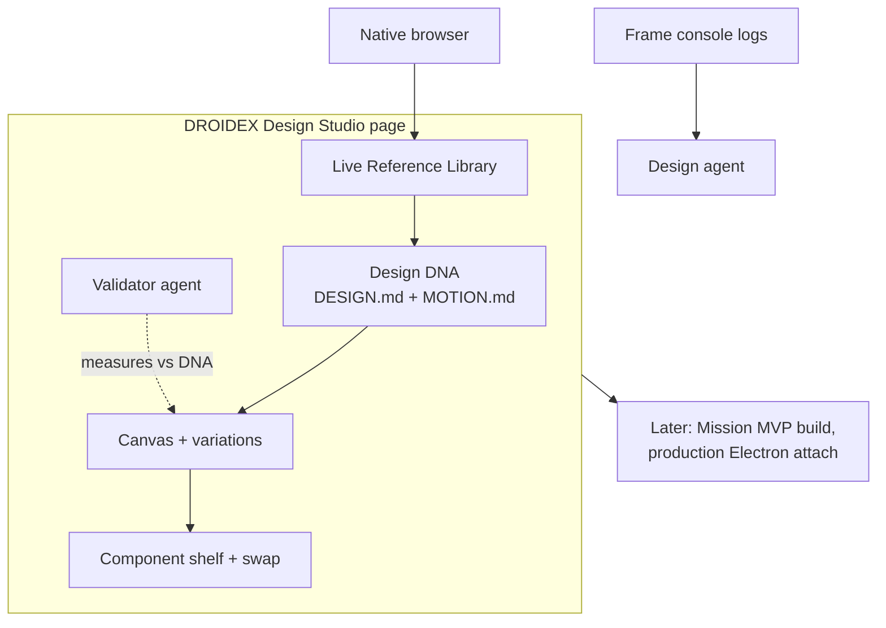

# DROIDEX design platform roadmap

Status: direction document, July 2026. Phases 1 and 2 are the near-term build targets. Later phases are sequenced direction, not commitments.

## Positioning

DROIDEX turns Droid Control into a design platform for developers who ship real products: local-first, repo-anchored, and enforced by measurement rather than taste.

The core thesis: design decisions must live in repo artifacts (`DESIGN.md`, `MOTION.md`, a component registry), get injected into every design prompt, and be enforced by a validator agent that measures rendered output against those artifacts. Everything runs on the user's actual codebase, their running dev server, and a real browser. No cloud sandbox, no credit meter, no export step that loses the mapping back to source.

What already exists in this repo and makes the plan credible rather than aspirational:

- A native browser pane with design mode: element, region, and text selection with cropped screenshots (`electron/nativeBrowserPreload.cjs`, `src/lib/iframeDesignMode.ts`).
- Source mapping from rendered elements to `file:line` via React fiber `_debugSource`, data attributes, and Vue/Svelte metadata (`ElementSource` in `sidecar/src/protocol.ts`, resolved in `electron/nativeBrowserPreload.cjs`).
- Structured design prompts: `DesignReference` packs with computed styles, ancestors, outerHTML, and screenshots, composed by `sidecar/src/browser/designPromptPacks.ts`.
- Computed-style DOM snapshots (`sidecar/src/browser/domSnapshot.ts`) capturing color, background, font family/size/weight, border, radius, display, position, opacity, and transform per element.
- A browser MCP server exposing twelve tools to agents (`sidecar/src/browser/browserMcpServer.ts`), including `design-mode` and `design_reference`.
- Viewport presets for desktop, laptop, tablet, and mobile (`VIEWPORT_PRESETS` in `sidecar/src/browser/BrowserSessionManager.ts`).
- A git operations layer (`electron/git.cjs`) with per-turn baselines, branch, worktree, stage, commit, and push, plus a `gh`-backed PR layer (`electron/github.cjs`).

## Competitive analysis

Four products define the current field. Each validates part of the thesis and falls short on the rest. Sources are from April to June 2026.

### Claude Design (Anthropic)

Launched April 17, 2026 as an Anthropic Labs research preview: a browser workspace at claude.ai/design that generates designs, prototypes, and landing pages, with design-system ingestion from codebases and design files.

Where it falls short:

- Fully cloud-hosted. Artifacts live in Anthropic's environment, and implementation requires a separate handoff bundle to Claude Code. It never touches your running app.
- Shares usage limits with regular Claude. Users reported that a single design-system upload exhausted a week of Pro limits in 15 minutes (r/Anthropic, April 2026), and heavy design use cannibalizes coding capacity on the same subscription (r/ClaudeAI, May 2026).
- Output is a prototype artifact, not a change to your product. Moving to production is the documented open problem.

### MagicPath 2.0

An infinite-canvas AI design tool repositioned in May 2026 around parallel agents building screens against a shared design system, with connectors to Claude Code, Codex, and Cursor.

Where it falls short:

- Credit pricing that punishes iteration: two screens cost 10 credits, a single navbar fix cost 5, and credits do not roll over (Banani hands-on review, 2026). Pro is $21 to $30 per month for 600 credits.
- Consistency failures inside a single project: a reviewed session produced two screens with two different bottom navigation bars.
- Export is React-only, generation runs took about 2 minutes each, and the claimed two-way codebase sync is unverified in practice.

### Cursor Design Mode

A visual editing mode in Cursor's built-in browser, shipped December 2025 and expanded in June 2026 with drawing, voice, and multi-select. Local-first: it edits your locally running dev server, which is the correct execution model and the closest competitor to this roadmap.

Where it falls short:

- Token drift. The manual controls attempt to map edits to existing CSS variables and tokens but "often miss or default to raw values" (Builder.io analysis, December 2025). Teams using Figma MCP plus Cursor documented agents hardcoding values instead of using their tokens (Medium post-mortem, January 2026).
- Source mapping is agentic search over injected element context, not a resolved anchor. The documented failure modes are hardcoded state-dependent styles and duplicate components: "five slightly different versions of the same component."
- No enforcement loop. Nothing measures the result against a design system after the agent runs.

### Figma Make and the Figma agent

Prompt-to-app generation with team library support, plus an MCP server that lets coding agents read Figma design context. At Config 2026 Figma added Motion, code layers, and agent skills.

Where it falls short:

- Sandbox-bound by default. Standard Make sessions run against Figma's hosted environment; downloaded code historically lacked even a runnable scaffold (Figma Forum, 2025).
- Credit metering with real backlash. Enforcement went live March 18, 2026 and forum threads called it something that "would greatly undermine Figma Make."
- The local-codebase answer exists but is gated: closed beta, waitlist, Mac-only, beta desktop app only, per-repo engineer setup, GitHub-only PR creation (Figma Help Center, May 2026). Figma validating the local thesis while gating it this hard is the opening.

### The gap

Nobody combines all four properties: local execution on the real app, deterministic source anchors from pixel to `file:line`, a design system that lives in the repo and gets injected into every prompt, and a validator that measures output instead of trusting it. Cursor has the first, partially the second, and neither of the last two. Claude Design and Figma have design-system ingestion but run in the cloud behind meters. DROIDEX builds the intersection.

## Demand evidence

- Lovable reached $400M ARR at a $6.6B valuation by March 2026; Cursor passed $2B ARR. Prompt-to-UI demand is settled. The fight is over where it runs and whether output survives contact with a real codebase.
- Recurring user requests to point cloud builders at existing repos (r/lovable, March 2026) rather than greenfield sandboxes.
- Figma's biggest 2026 Make investment is "Make in your local codebase" (real repo, real data, PRs), a direct concession that sandbox prototypes were not enough.
- Onlook, an open-source visual editor for local React apps, front-paged Show HN; superdesign.dev ships a design agent inside the IDE. Both signal appetite for local, repo-native design tooling.
- Consistency is the named pain: "Without a design system and design tokens, every AI output pulls your product in a different direction" (Boldare, April 2026). A consulting cleanup economy has formed around fixing AI-generated apps (r/ExperiencedDevs thread, 404 upvotes, April 2026).
- Credit metering frustration is documented for both Figma Make and Claude Design. Local tools bounded by the user's own agent subscription avoid the whole category of complaint.

## Phase 1: Design DNA

The artifact layer. Everything later depends on it, so it ships first.

### 1. DESIGN.md engine

**What.** Generate and edit a project-root `DESIGN.md` in the portable Google format: color tokens, type scale, spacing scale, radii, shadows, density rules, component conventions, and an allowlist section for validator suppressions.

**Why.** A design system that lives next to the code is versioned, reviewable, and readable by any agent, not just ours. Portability is deliberate: a `DESIGN.md` that works in other tools is easier to adopt than a proprietary token store.

**Architecture.** Three generation sources:

- Repo scan: parse Tailwind config and CSS custom properties, and sample computed styles from the running app via the `DOM_SNAPSHOT_SCRIPT` style keys in `sidecar/src/browser/domSnapshot.ts` (already captures color, backgroundColor, fontFamily, fontSize, fontWeight, border, borderRadius, and more per element).
- Curated library pick (feature 3).
- Extraction from references (Phase 3, feature 9).

Generation runs as a scoped agent prompt; the file is plain markdown, so users edit it directly or through the Studio editor. No design-token layer exists in the repo today, so this is net-new code with existing capture primitives.

**Dependencies.** None. First deliverable.

### 2. MOTION.md

**What.** A sibling artifact for motion: easing curves, duration scale, hover and press behavior, transition conventions, reduced-motion policy. Ships with curated presets.

**Why.** Motion is where AI-generated UI most visibly turns to slop, and no competitor encodes it at all. The existing `DESIGN_MODE_GUIDANCE` block in `designPromptPacks.ts` already carries anti-slop defaults; `MOTION.md` makes them project-specific and versioned.

**Architecture.** Same engine as `DESIGN.md`. Computed-style capture already includes `transform` and `opacity`; transition and animation properties get added to the snapshot style keys.

**Dependencies.** DESIGN.md engine (shared generation and editing path).

### 3. Curated DNA libraries

**What.** A shipped gallery of `DESIGN.md` and `MOTION.md` starting points: minimal, editorial, enterprise-dense, brutalist, and so on. One click writes the pair to the project root, then the user diverges.

**Why.** Cold start kills adoption. A new project should get a coherent, opinionated system in seconds without prompting for one.

**Architecture.** Static assets bundled with the app, rendered as preview cards in the Studio. Writing them is a plain file write through the existing Electron file channels.

**Dependencies.** DESIGN.md engine.

### 4. Prompt injection and the design-system MCP tool

**What.** Two delivery paths for DNA. First, `formatDesignPrompt` in `sidecar/src/browser/designPromptPacks.ts` gets extended to inject the project's DNA (or a compact digest of it) into every design prompt. Second, a new `design-system` MCP tool lets any agent query tokens and rules on demand mid-task.

**Why.** This is the direct answer to Cursor's token-drift complaint. Injection covers the start of a task; the MCP tool covers the middle of one, when an agent is deciding whether `#6b7280` should be `--color-muted`.

**Architecture.** Injection is a change inside `formatDesignPrompt`, which already composes header, references, and guidance blocks; DNA becomes another block, with `sanitizeInline`-style limits so a huge DESIGN.md cannot blow up the prompt. The MCP tool is a new `createDesignSystemMcpServer` module built with `createSdkMcpServer` (same factory as `browserMcpServer.ts`), added to the server array in `MissionManager.startLocalMcpServers`. That seam requires no manifest or config registration.

**Dependencies.** DESIGN.md and MOTION.md exist and parse.

## Phase 2: Design Studio and the validator agent

### 5. Studio page

**What.** A full top-level view alongside chat and Mission Control, dedicated to designing with agents. Hosts the DNA editor, validator configuration and findings, the reference library, the canvas, and the component shelf.

**Why.** Design work has different furniture than chat: persistent artifacts, side-by-side frames, findings lists. Cramming it into the chat surface would bury it.

**Architecture.** `App.tsx` has no router; the main section renders `<MissionControl />` when the active mission is a `mission_orchestrator`, otherwise `<ChatView />`. The Studio becomes a third branch driven by store state, with a navigation entry in `src/components/Sidebar.tsx`. The right-side `BrowserPane` and its mutual exclusion with `RightPanel` stay as is; the Studio composes the same `BrowserWorkspace` internals.

**Dependencies.** Phase 1 artifacts to display. Canvas and shelf sections fill in as Phases 3 to 5 land.

### 6. Standalone consistency validator

**What.** A validator session spawned over the bridge JSON protocol through new `design.validator.*` commands (`design.validator.configure`, `design.validator.run`, `design.validator.findings`, following the `session.create` shape in `sidecar/src/protocol.ts`). Completely independent of mission orchestration: today's validators are subagents the orchestrator spawns via its Task tool, while this one is user-owned and runs against any project with a `DESIGN.md`. Configurable in the Studio: editable system prompt (we ship a hardened default), model picker, page scope, and run triggers (manual, or after each design prompt).

**Why.** Every competitor generates and hopes. Enforcement is the differentiator, and it has to be a first-class object the user can inspect and tune, not a hidden step.

**Architecture.** New command variants land in both `sidecar/src/protocol.ts` and its mirror `src/types/bridge.ts` (the header says keep in sync; every protocol change is a dual edit), with typed wrappers in `src/lib/commands.ts` and dispatch in the sidecar's `ClientCommand` switch. The validator session reuses the SDK session plumbing that `session.create` uses and attaches the browser MCP server plus the design-system tool.

**Dependencies.** Phase 1 (it needs something to validate against), Studio page for configuration UI.

### 7. A validator that measures

**What.** Not a vibe check. The validator walks configured pages via the browser MCP tools per viewport preset (`fit`, `desktop`, `laptop`, `tablet`, `mobile` already exist in `BrowserSessionManager.ts`), pulls DOM snapshots, and numerically diffs computed styles (colors, type scale, spacing, radii, shadows) against `DESIGN.md` tokens. Each violation resolves to a source anchor (`file:line` via `ElementSource`) and emits a structured finding: screen, element, expected token versus actual value, cropped screenshot, suggested fix. Each finding carries a one-click fix that dispatches a scoped design prompt. The allowlist section in `DESIGN.md` suppresses known-good exceptions so the findings list stays trustworthy.

**Why.** Numeric diffing against declared tokens is the part of design review a machine does strictly better than a human, and it is exactly the part every competitor skips.

**Architecture.** The measurement path is `browser_open`, `browser_resize`, `browser_snapshot`, and `browser_screenshot` from `browserMcpServer.ts`. The snapshot's style keys cover the diffable properties; shadow capture (`boxShadow`) gets added to `STYLE_KEYS`. Source anchors come from the existing `resolveSource` chain in `nativeBrowserPreload.cjs` (React fiber `_debugSource` first, data attributes as the framework-agnostic fallback, Vue and Svelte metadata after). Findings stream back as new `ServerEvent` variants and render in the Studio. Note the current source resolution depends on development builds (fiber debug metadata); production-build resolution is a Later-roadmap item.

**Dependencies.** Feature 6.

## Phase 3: Live Reference Library

### 8. Persistent, clickable references

**What.** Design-mode selections persist into a project-scoped library instead of dying with the prompt that used them. `DesignReference` already carries what this needs: `DesignAnchorDetail` holds the verified selector, attributes, computed styles, ancestor chain, and captured `html` (outerHTML), and the reference carries viewport, scroll, and screenshot. Component references render live in sandboxed iframes (srcdoc built from captured markup plus styles) so hover and click states actually work; users test the thing, they do not stare at a screenshot. Full-page references reopen live in the native browser via `browser.open`.

**Why.** Reference-driven design is how people actually work ("make it feel like this"). Live references beat static crops because interaction states are half of what makes a component feel right.

**Architecture.** Persistence extends the existing pack storage under the browser design-reference directory (`browserDesignReferenceDir`, used by `writeDesignPromptPack`) from per-mission to project-scoped. Live rendering is a renderer-side component: sandboxed iframe, `srcdoc` from `DesignAnchorDetail.html` plus a scoped style block synthesized from captured computed styles. Sandboxing stays strict: no scripts from captured markup, no network beyond same-document assets.

**Dependencies.** Studio page for the library UI. Independent of the validator.

### 9. Style extraction and mixing

**What.** Extract palette, type, and spacing from a reference into `DESIGN.md`. Compose screens from multiple references (header from A, cards from B) under your own DNA so the output feels original rather than cloned.

**Why.** This closes the loop between Phase 3 and Phase 1: references are not just prompt attachments, they are DNA sources. Mixing under a declared DNA is the "better mix, not a clone" position in one feature.

**Architecture.** Extraction is an agent prompt over the reference's captured styles feeding the DESIGN.md engine. Mixing extends `formatDesignPrompt` reference blocks with per-reference role annotations (which part of which reference applies to what).

**Dependencies.** Features 1 and 8.

## Phase 4: Canvas, variations, and the console loop

### 10. Multi-frame canvas

**What.** Live screens side by side: N variations of a screen as sibling frames, and the same screen across phone, tablet, and desktop simultaneously.

**Why.** Variation comparison is the strongest pattern the canvas tools (MagicPath, Figma Make) got right. It belongs on top of a real dev server instead of a sandbox.

**Architecture.** Extends the `BrowserCanvas` and `iframeDesignMode` path. `BrowserCanvas.tsx` currently renders one screenshot surface inside `SmoothCanvas`; the multi-frame layout generalizes that to a grid of live iframes against the dev server, each with its own viewport preset. Viewport presets already exist; per-frame variation state is new.

**Dependencies.** Studio page. Benefits from Phase 1 DNA injection for variation generation.

### 11. Console context loop

**What.** Every prototype and variation frame pipes console errors, warnings, and failed requests back to the design agent, so a broken prototype self-diagnoses and gets fixed on user prompt instead of silently shipping a dead frame.

**Why.** The single most common failure mode of AI-built prototypes is the frame that renders nothing because of a runtime error nobody surfaced.

**Architecture.** Greenfield: no console or network capture exists in the repo today. For iframe frames, an injected hook over `console` and `fetch` in the frame document (same injection point as `attachIframeDesignMode`). For the native browser, the `webContents` `console-message` event in the Electron main process, forwarded over the existing preload channels. Captured entries attach to the frame's context and flow into the next design prompt as a structured block.

**Dependencies.** Feature 10 for per-frame attribution; the native-browser path can ship earlier on its own.

### 12. Design selector inside frames

**What.** The existing element, region, and pencil selector works inside every prototype frame, so iterating on a variation feels identical to iterating on the main page. Zero new concepts.

**Why.** The moment variations are second-class (no selection, screenshot-only) users fall back to the main page and the canvas dies.

**Architecture.** `attachIframeDesignMode(iframe, { designMode, pencilMode, onSelection })` already returns a cleanup function and emits `NativeBrowserSelection` shapes; the multi-frame canvas attaches it per frame and tags selections with the frame id. The iframe path's computed-style capture is currently a smaller key set than the sidecar snapshot (no border, radius, position, opacity, transform); those keys get aligned so references from frames are as rich as references from the native browser.

**Dependencies.** Feature 10.

## Phase 5: Component shelf and three-dots swap

### 13. Component shelf

**What.** The project's real components rendered live and clickable in the Studio, sourced from the repo (component registry) and the reference library.

**Why.** The shelf is the design-system made tangible. It is also the supply side of swaps: you cannot swap to a component you cannot see.

**Architecture.** Repo-sourced entries come from a component registry built during the Phase 1 repo scan (exported components plus the `file:line` they live at); rendering reuses the live-iframe machinery from feature 8. Reference-sourced entries are library items directly.

**Dependencies.** Features 1 and 8.

### 14. Three-dots swap workflow

**What.** Navigate the real site, hover or select a component, and a three-dots affordance opens a menu: Swap component (pick from shelf or references), View code (jump to the resolved `file:line`), Edit (scoped design prompt).

**Why.** This is the shortest path from "I dislike this card" to a reviewed diff, and it only works because selection already resolves to source. Competitors with weak source mapping structurally cannot ship this.

**Architecture.** The affordance extends the design-mode hover overlay in `nativeBrowserPreload.cjs` and `iframeDesignMode.ts`. View code uses `ElementSource.file/line/column` directly. Edit dispatches through the existing `browser.design.sendPrompt` path. Swap is feature 15.

**Dependencies.** Feature 13, plus Phase 2 source-anchor hardening.

### 15. Integration-safe swaps

**What.** The swap prompt carries a context contract: source anchor, ancestor chain, props and call sites, plus explicit scope rules (preserve the component API, or migrate all usages), so swaps on a real app do not break integrations. Live preview rides the existing dev-server auto-reload. Each swap is a discrete commit for one-click revert.

**Why.** Swapping components on a production codebase is where every generation tool breaks things. The contract turns a risky freeform edit into a bounded refactor.

**Architecture.** The anchor and ancestor chain already exist (`DesignAnchorDetail.ancestors`, `ElementSource.componentChain`); props and call sites come from a repo-side scan seeded by the resolved file. Commit-per-swap is grounded in `electron/git.cjs` (`markTurnStart` for per-turn baselines, `stageAll`, `commit`); revert is a plain `git revert` of that commit. Caveat: `git.cjs` and `github.cjs` exist but are not yet wired through `electron/main.cjs` IPC and the preload; that wiring is a prerequisite and is already planned for the environment panel work.

**Dependencies.** Features 13 and 14, git IPC wiring.

## Later roadmap

Direction, deliberately not scheduled.

- **Mission Control design-to-MVP.** A finalized DNA plus a populated shelf feed a mission where inexpensive worker agents mass-produce screens and the Phase 2 validator gates feature completion. The mission plumbing exists (`MissionManager`, orchestrator-spawned workers and validators, per-mission model config); deferred by decision until the Studio loop is proven on single screens.
- **Production Electron app attachment.** Integrate the in-progress capability to select, inspect, and design against compiled Electron binaries, letting users work on production apps rather than dev builds. This also forces the production-build source-mapping work flagged in feature 7. Nobody else in the space has this.
- **Figma round-trip import.** Import direction only becomes worth building once the DNA and shelf give imported frames somewhere coherent to land.
- **Voice-directed design input.** Cursor shipped voice in June 2026; the selector-plus-instruction model here extends to voice naturally, but it is an input method, not a platform layer.

## Open questions

1. **DESIGN.md schema strictness.** Fully freeform markdown maximizes portability; a structured token block (fenced YAML or JSON) makes the validator's diffing deterministic. Current lean: structured token block, freeform prose around it.
2. **Validator cost control.** Full walks across five viewports and many pages could be slow and token-heavy. Options: incremental validation scoped to the last diff, screenshot-free style-only passes, or a local non-LLM diff pass with the agent only interpreting violations. Needs measurement on a real project.
3. **Reference library scope.** Project-scoped is the default; a personal cross-project library is attractive (bring your taste with you) but raises questions about leaking one client's UI into another's project. Likely: project-scoped with explicit export/import.
4. **Snapshot style-key growth.** Features 2, 7, and 12 each widen the captured style set. The three capture implementations (`nativeBrowserPreload.cjs`, `iframeDesignMode.ts`, `domSnapshot.ts`) must stay aligned; worth extracting a shared key list before Phase 2 rather than after.
5. **Non-React source resolution quality.** The exact-confidence path leans on React fiber `_debugSource`. Vue and Svelte paths exist; plain-HTML and production builds fall back to attributes or nothing. How much Phase 5 swap UX degrades at `confidence: 'heuristic'` or `'none'` needs real-world testing.
6. **Where validator findings live.** Ephemeral per-run, or persisted as a findings file in the repo (reviewable in PRs, diffable over time)? Persistence is attractive for enterprise audit trails but adds repo noise.
