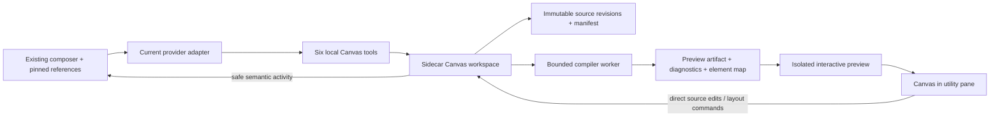

# DROIDEX Canvas design specification

Status: proposed implementation, prepared for the user's later Fable 5.1 handoff. No Canvas feature has been implemented by this planning task.

## Product intent

Build a persistent, editable canvas inside DROIDEX where the current chat's agent creates real interactive interfaces. Designs remain on the board while the user asks for changes, compares variants, selects another component, or starts a chat attached to the same canvas. Open Canvas from the right utility pane and expand it without introducing a second conversation or composer.

The experience should feel as direct and fluid as the two recordings: name a design, see its frame arrive, watch a working preview appear, click its controls, inspect its code, and make alternatives beside it. All supported harnesses use the same DROIDEX tools, storage, rendering pipeline, design systems, and selection contract.

Suggested product description after shipping: **“Design with any agent. Keep a canvas of working interfaces beside your chat.”**

Execution plan: [DROIDEX Canvas implementation plan](../plans/2026-10-05-droidex-canvas.md).

## 1. Visual references and evidence

These are the original local recordings supplied by the user. They are reference material, not files to copy into Git. Timestamps are approximate review anchors, not frame-accurate measurements.

| Reference | Original file | Duration | What it establishes |
| --- | --- | --- | --- |
| V1 | [Screen Recording 2026-10-05 at 12.10.35 PM.mov](</Users/anas/Desktop/Screen Recording 2026-10-05 at 12.10.35 PM.mov>) | 1:57 | Persistent component board, real clickable controls, theme selection and explicit design-system reference |
| V2 | [Screen Recording 2026-10-05 at 12.39.57 PM.mov](</Users/anas/Desktop/Screen Recording 2026-10-05 at 12.39.57 PM.mov>) | 2:38 | Successful generation, loading/reveal animation, code drawer, variants, component navigation and a retained canvas beside a fresh composer |

| Reference / time | Observed behavior | DROIDEX requirement |
| --- | --- | --- |
| V1 0:00–0:25 | A row of named 720 × 720 designs: Buttons, Inputs, Cards, Navigation, Tabs, Badges, Dialog, Data Tables; some are not ready | Multiple durable named frames with independent build/error states |
| V1 0:30–0:55 | Zooming into components; tabs and navigation respond to clicks; frame tools are nearby | Cursor-anchored zoom, select/interact modes, genuine component events, contextual frame tools |
| V1 1:15–1:35 | A preset picker includes OpenAI and Claude | A compact design-system picker integrated with the existing composer |
| V1 1:35–1:57 | A selected Claude system is referenced in the request; generation then hits a quota limit | Pin the chosen system to a request; show a real failure without losing the board. This segment does not prove successful generation |
| V2 0:00–0:15 | An empty canvas, Agent/Components/Libraries navigation, a selected theme and a “hey” request | Useful empty state; one chat; Components and Library views local to Canvas |
| V2 0:15–0:35 | A named frame appears with an animated dot/dither bloom; named working presence and changing stages | Immediate pending frame, restrained busy animation and truthful activity |
| V2 0:35–0:45 | The preview resolves to a warm greeting card with a wave and CTA | First working preview reveals inside the same frame |
| V2 0:45–1:05 | Pan, zoom and selection handles; CTA changes from “Get started” to “You're all set” with a check | Real React state and events; frame movement independent of component interaction |
| V2 1:05–1:20 | Floating toolbar, v1, React source drawer, revision picker, more menu | Read/edit source, revision history, refresh, rename, duplicate, export and local reuse |
| V2 1:20–1:35 | A variants panel exposes layout/style/color choices and a count of two | Create variants from a pinned revision with explicit requested differences |
| V2 1:35–2:15 | Original stays visible while two adjacent variants finish independently; another CTA works | Independent frames/builds; original untouched; variants can be inspected while siblings generate |
| V2 2:15–2:25 | Searchable component list and an empty library view | Search, focus and reuse designs without hunting across the board |
| V2 2:25–2:38 | Fresh composer while prior designs remain | “New chat with this canvas” explicitly retains the canvas attachment |

The recordings do not prove token-by-token JSX execution, persistence after restart, arbitrary source editing, direct element editing, cloud collaboration, or successful sharing/export. Those are either requirements defined below or explicit exclusions. Match the interaction qualities and pacing, not MagicPath branding, invented agent activity, or an assumed private implementation.

## 2. Release scope and completion

The complete local release includes:

1. Canvas in the existing right utility pane, expansion, one existing composer, discoverable empty state and keyboard navigation.
2. Persistent multiple frames, pan/zoom/fit, drag, resize, multiselect, alignment, component search and stable IDs.
3. React previews with real event handlers, incremental complete-file checkpoints, useful build errors and a last working preview.
4. Default design systems, pinned versions, reusable components, image references and bounded internal guidance.
5. Element selection, deterministic direct edits, source editing and natural-language edits scoped to selected references.
6. Source revisions, restore, duplicate, independently generated variants, local library and local source/image export.
7. Truthful progress, smooth motion, reduced-motion support, light/dark polish and bounded preview mounting.
8. Identical tooling for Droid, Claude Code and Codex, with an explicit contract for future adapters.
9. Clean DROIDEX chat, history, search and export: no injected design instructions or raw Canvas scaffolding rendered as conversation content.

The first end-to-end slice is a milestone, not completion of this specification. Cloud sharing, multiplayer, Figma import/export, freehand drawing, arbitrary npm installation, hosted publishing and a template marketplace are outside this release. Do not show inert menu entries for them. Image export and the local library are included. This replaces no existing feature by implication; remove old code only when it is actually superseded.

## 3. Global constraints

- Runtime: Node.js 22; existing Electron, React 19, TypeScript, Tailwind 3 and framer-motion toolchains.
- Providers: Factory Droid, Claude Code and Codex must pass the same Canvas contract before release.
- Ownership: the sidecar owns durable Canvas state; renderer state is a projection plus transient interaction state.
- Identity: `canvasId`, `designId`, `revisionId` and revision-scoped `elementId`; never `providerSessionId` as a Canvas owner.
- Source: one canonical React/TypeScript source tree per revision; no parallel editable DOM or design DSL.
- Tool budget: six Canvas MCP tools; no tool per UI button and no second agent runtime.
- Dependencies: no new canvas framework, global harness configuration edits, CDN runtime, per-design dev server or per-design npm install.
- Privacy: internal Canvas guidance and raw Canvas tool payloads must not enter DROIDEX conversation display, searchable history or conversation exports.
- UI: existing `--droid-*` tokens, soft surfaces, working keyboard controls, light/dark verification and reduced-motion support.
- Compatibility: one current contract; no legacy importers, old-PR adapters or silent migrations.
- Scope: implement locally; commits, pushes, PRs, merges and publishing require the user's existing or later authorization.

Existing dependencies that become runtime components still need packaging and dependency review. In particular, sidecar esbuild is currently a development dependency; its presence does not establish a usable compiler in a packaged app.

## 4. Workspace and interaction design

### Placement and navigation

Add **Canvas** to the utility-tool picker. Opening it creates no blank design and starts no compiler until needed. The empty state explains “Ask your agent to design something” and offers example requests through the existing composer. A toolbar exposes Select/Interact, zoom, Fit, Components and Library. The inspector contains element properties, source and history; it should not be a permanently empty third column.

Expanding changes the space allocated to the same board. Keep the selected frame, viewport and live preview instance where feasible; do not remount the entire Canvas on pane resize. Closing the pane releases live previews but retains source, layout and attachment. Reopening reconstructs from durable state.

A canvas has its own identity, independent of chat/provider lifecycle. A chat can have one attached canvas initially. “New chat with this canvas” creates an explicit attachment to the existing canvas; ordinary New chat starts without one. Two attached chats may edit the same canvas using revision checks. Open saved canvas makes detached work discoverable. Deleting a chat removes its attachment, not its designs. Canvas deletion is a separate explicit operation that shows affected attachments and preserves independently saved library items.

### Board controls

- Background drag/Space-drag pans. Wheel/pinch zoom anchors under the pointer. Fit and focus use the same geometry functions.
- Select mode gives the board pointer ownership; click a frame to select it, double-click or press Enter to interact. Interact mode gives the preview real pointer/keyboard events. Escape returns to selection; Escape again clears selection. Do not intercept shortcuts typed inside an input/editor.
- Frame headers remain draggable in both modes. Resize changes viewport dimensions, making responsive layouts real. A soft selected indicator and size label are sufficient; avoid thick permanent outlines.
- Shift-click/rubber-band selects several frames. Align and distribute affect layout only. Arrow keys nudge selected frames; Delete removes selected frames with Undo. Source-editor undo and board undo have separate focused scopes.
- Context tools include rename, source, history, variants, refresh, duplicate, add to library, export source, export image and delete. Each must work before its control is exposed.
- Components is a virtualized searchable list of design names, states and small previews. Clicking focuses the frame. Library contains named immutable revision copies and can insert an independent design; the original canvas is provenance, not a storage dependency.
- First creation may fit once if the user has not navigated. Builds and variants must not steal the viewport afterward. New work outside the viewport gets a “Show design” action.

Live previews are guest `<webview>` elements in the board's DOM flow. Use the board transform and pane clipping for them; renderer toolbars, selection handles and popovers can paint above the guests. Select mode installs a transparent DOM input overlay; Interact removes it. Commit the mode's overlay/hit-test state to the compositor before accepting subsequent input, and handle an active scroll gesture explicitly rather than assuming it has ended. Task 5 must verify transformed input and four-preview composition in the real board.

### Elements, source and references

The inspector selects an element in the rendered preview and outlines it without changing the component's behavior. A build-time JSX transform supplies source locations and revision-scoped element IDs. Runtime instance paths distinguish repeated DOM nodes; they are selection hints, not a second source model.

Direct editing supports literal text, allowlisted token-backed style values, and owned image references where the source mapping is unambiguous. Apply edits to the source tree, then build a new revision. Shared component definitions, computed text and repeated expressions show the actual edit scope and route ambiguous changes through the agent. Never persist a DOM-only edit that disappears on rebuild. Changing one repeated instance requires a real data/source change; it cannot silently change every instance.

The source drawer has file navigation, editing, diagnostics, Save and revision comparison. A dirty buffer is local editor state; saving uses the revision captured when editing began. A conflict preserves that buffer and offers comparison/reapply, never silent overwrite. Viewing an old revision does not move the current head; Restore creates a new revision from it.

Selected designs/elements and the selected design system appear as concise composer chips. Sending pins their IDs and revision numbers to that request. Queue, steer, send-now and retry preserve those references; later selection changes cannot retarget an earlier request. Users can remove chips. A user-authored sentence that happens to resemble an internal instruction must remain intact.

## 5. Rendering and incremental generation

`canvas_create` reserves named pending frames immediately. The model writes complete changed files through `canvas_write`; the server never treats a partial tool-argument stream as executable JSX. Every accepted write checkpoints source. The compiler coalesces superseded jobs per design and builds in a worker. The model is guided to submit a small working composition first, then richer complete checkpoints. Do not synthesize typing or delay a finished preview to imitate streaming.

Each revision carries its source and design-system version. Compilation produces a derived artifact. Publish only if the captured canvas/design/source version and lifecycle generation are still current. Frame movement has a separate layout version and cannot invalidate a source build. Failed builds retain their source and diagnostics; the frame labels the older working preview with its revision. On initial failure, show a useful error frame with Retry/Edit source. Never label old content as the new revision.

The initial runtime resets component-local React state when a new revision is installed. Panning, selecting, changing the pane width or opening the inspector must not reset a mounted preview. Refresh intentionally resets it. Explain revision resets unobtrusively when a stateful preview updates; do not implement generic state serialization or hot-reload machinery in this release.

Use one small virtual source project per design: `main.tsx` with a default component export, optional relative TS/TSX/CSS modules, owned assets, a pinned design-system import and a declared runtime allowlist. Compile React and the existing Tailwind generation path from bundled local assets. No arbitrary filesystem resolution, server code, package lifecycle scripts or network imports. Unsupported imports fail with the supported choices. Dynamic Tailwind classes must use explicit complete class names or system tokens.

Initial limits are product contracts: 64 source files/design, 1 MiB total UTF-8 source, 256 KiB/file, 10 MiB/owned image, 20 MiB tool result or export transfer, two compiler jobs concurrently, 15 seconds/build, four live previews per board and six seconds/screenshot. Validate these at the boundary and return actionable errors. Asset libraries and historical revisions do not get silently deleted when a limit is reached. Benchmark the live-preview cap before raising it.

Visible/selected frames receive the live-preview slots. Other frames use a cached image when available, otherwise a labeled static placeholder. Clicking Interact transfers a slot. Snapshot failure cannot block source saving, generation or closing a session. These constraints must work when capture is unavailable, including a sleeping/locked display.

## 6. Sandbox and runtime readiness gate

Start from the app's existing `AppBlock` isolation ideas, not its source/remount lifecycle. Generated code gets no Electron preload, Node APIs, app bridge, cookies, repository access or unrestricted network. The proposed presentation is an opaque-origin `sandbox="allow-scripts"` preview with restrictive CSP and owned assets. No `allow-same-origin`, popups, top navigation, forms or external resource loading. Block external navigation rather than delegating arbitrary destinations to the OS.

The preview bridge accepts only resize/readiness, bounded diagnostics and selection/interaction messages. Verify sender window, per-instance nonce, design ID, revision ID and generation. A nonce correlates messages; code inside that same preview can observe it, so it is not an authorization boundary. The parent grants no privileged RPC capability through that channel. Canvas MCP mutation access is separately bound to an authorized session/turn.

**Measured preview-host decision (Task 1a, 2026-10-06):** use one `<webview>` guest host in the renderer DOM per live preview. The guest loads an owned trusted intermediate on a privileged standard/secure scheme; it contains the opaque-origin `sandbox="allow-scripts"` generated iframe. Chat, guest and generated frame have three distinct OS PIDs. Generated `top.postMessage` reaches the guest intermediate, not chat: each measured burst sent 200,000 messages, guest receipt checkpoints reached 10,000–20,000 before teardown, and chat's direct message count stayed zero. There is one host implementation; no direct iframe, ordinary nested iframe or `WebContentsView` fallback.

Task 3 must enable `webviewTag: true` only on the owning app window and install `will-attach-webview` hardening before renderer content can create guests. Allow only the owned preview source, delete any requested preload, force `nodeIntegration` and `nodeIntegrationInSubFrames` off, `contextIsolation` and `sandbox` on, keep `webSecurity` on, and disable nested guest `webviewTag`. Restrict guest navigation and deny new windows. The retained probe deliberately requests a preload and Node integration and verifies they are stripped. No guest preload was needed: the measured channel uses the webview element's `executeJavaScript` API to start work and poll a trusted snapshot. Task 3 must implement that pull channel with audited literal scripts, bounded validated payloads, a bounded polling cadence and one in-flight poll per guest; generated code receives no Electron API. Main owns an independent watchdog and guest termination through its owned `webContents`, without waiting for a guest response. Revalidate guest identity/generation after awaits and retain canonical source during replacement.

The final 10-second no-termination guest flood observations sampled chat and main concurrently: chat max/p95 1178.53/2.42 and 1219.03/2.54 ms, main max/p95 75.62/1.61 and 79.11/1.55 ms; no chat renderer died and its PID stayed unchanged. Guest DOM removal released both child PIDs in 27.99 ms; main-side `forcefullyCrashRenderer` in 2038.26 ms, with next chat responses 0.88/1.63 ms. The guest reported `render-process-gone` with reason `killed`, exit code 2 after the forced crash. Timing is workload-sensitive: native-host maxima ranged from 88.91 to 2099.39 ms, and earlier guest samples from 581.39 to 1905.77 ms. The guest meets the measured external deadline and comparable-latency gate while preserving DOM composition. Main must terminate the queue owner, not only the generated sender; a late sender-only kill leaves an existing receiver backlog intact. Production rate/payload limits, polling through a deep queue and poll-timeout cleanup still belong to Task 3.

Four inspected 2000×1400 PNGs (1000×700 CSS viewport, 2× scale) confirmed DOM composition. Baseline guest bounds were (100,100)–(300,300); wrapper translation (40,30) and scale 0.5 produced (140,130)–(240,230), and a 40×40 internal marker became 20×20. A 50%-blue DOM overlay painted over the guest; parent `overflow:hidden` clipped it to (100,100)–(200,200). Pointer/wheel input reached generated code in Interact; a committed transparent Select overlay received them instead, without incrementing guest counters. Hey and all tested generated escape refusals passed. Input sent before the overlay's compositor commit initially used stale hit-test state; the corrected external probe waits for paint, and a transition probe observes `gestureScrollEnd` before starting a new wheel gesture. This does not verify switching mode during an active physical trackpad gesture.

The ordinary nested DOM iframe remains rejected: 73 generated `top.postMessage` calls bypassed its intermediate and reached chat in 87.90 ms, despite three distinct PIDs. Its no-termination flood also paused chat for 1345.50–2568.49 ms, with one HTTP-origin run missing the 3-second deadline. Direct iframe delivery, first-field rejection and sender-only termination had already failed the deep-queue gate. The interim `WebContentsView` isolated the queue but was replaced after the guest's transform, clipping and DOM overlay checks passed. Detailed historical and final guest measurements are in Task 1.

The arm64 development runtime passed isolation, escape refusal, bounded capture during a hung frame, and V8 heap exhaustion (3,904 MiB of double-array payload reported / 3,997.33 MiB RSS observed before only the frame died). This is not a packaged-runtime or x64 pass; huge DOM creation and unsupported-import diagnostics remain unverified. Detailed measurements are in the plan's Task 1 evidence.

**Measured compiler decision:** choose native `esbuild` 0.24.2 (MIT) in the compiler worker. Fresh-worker cold build was 21.81 ms; five warm builds had a 5.29 ms median. `esbuild-wasm` 0.24.2 (MIT) was 265.14 ms cold / 51.30 ms warm median, with the same 9,425-byte Hey artifact. Tailwind 3.4.19 JIT in a separate fresh worker was 99.69 ms cold / 8.75 ms warm median. The fixture has no utility classes; its 10,210-byte CSS is preflight, not a representative utility-heavy workload. Cold timings include module/service initialization but exclude worker creation; filesystem caches were warm.

Package the new compiler worker entry explicitly in `sidecar/dist`. Beside it, in `extraResources` under `sidecar/canvas-runtime/`, ship:

- Native `esbuild/{package.json,lib/main.js,LICENSE.md}` (90,297 bytes) and the selected architecture's unpacked binary: `@esbuild/darwin-arm64/bin/esbuild` (9,750,242 bytes) or `@esbuild/darwin-x64/bin/esbuild` (10,432,176 bytes). Give the worker the owned absolute binary path through `ESBUILD_BINARY_PATH`; never rely on checkout resolution or download it at runtime.
- Locally bundled React 19.2.7 / React DOM 19.2.7 / JSX runtime (193,959 bytes), bundled Tailwind/PostCSS JIT (2,290,150 bytes), its legal notices (1,451 bytes), and `css/preflight.css` (7,805 bytes). The relocated Tailwind bundle produced the same CSS without checkout module resolution. Include React, React DOM, scheduler, Tailwind and PostCSS license files (5,430 bytes together). Supply the compiler's React imports from the same runtime instance as the renderer; the full executable Hey probe bundled both together (193,998 bytes).
- The common measured assets total 2,498,795 bytes. With the compiler API/binary, native totals are 12,339,334 bytes arm64 and 13,021,268 bytes x64. These are uncompressed resource estimates, excluding the not-yet-implemented worker, curated fonts/assets, archive overhead and signing. x64 binary size was inspected, never executed. Native is about 9.7× faster warm and saves 2,169,517 bytes versus the WASM option on arm64.

The rejected WASM option requires `esbuild.wasm` (11,907,565 bytes) **and** its Node API/launcher assets (`lib/main.js`, `bin/esbuild`, `wasm_exec.js`, `wasm_exec_node.js`, `package.json`, `LICENSE.md`: 102,491 bytes), totaling 14,508,851 bytes with the common assets. Both Node APIs spawn compiler service processes; cancellation must clean those up as well as the worker thread. The scratch supervisor verified service PIDs gone after worker-parent shutdown; in-process timeout cleanup remains a Task 3 contract.

Today esbuild is only a sidecar devDependency. The sidecar build script uses its CLI to bundle the application/history worker; it does not deliver a runtime compiler. `extraResources` copies only `sidecar/dist`, so none of the new resources are currently packaged. Packaging changes, both macOS architecture runs, and dependency security review are still required in Task 3 (Sonatype was unavailable for this probe). No runtime download or network prerequisite is allowed for an existing saved design.

**Harness readiness gate:** the binding is the one the existing in-app tools already rely on: DROIDEX starts one loopback MCP server per `appSessionId` (`SessionManager.startLocalMcpServers` → `createSdkMcpServer`), so the endpoint itself identifies the session, and the sidecar serializes primary turns per session. Canvas mints an immutable scope lease when a turn begins, pinning that turn's selection and design system; `canvas_read` returns the lease ID, mutations present it, and a call that arrives after settlement, under a later generation, or from a replaced provider session is rejected with `scope_expired`. Do not solve a stale call by consulting the latest selection or prepending hidden text to the user prompt.

**Measured lease binding (Task 1b, 2026-10-05, live sessions through `SessionManager.handle` with a scratch per-session probe server; Droid CLI 0.233.0, Claude Code 2.1.289, Codex 0.160.0, Factory SDK 0.6.0):**

- The mutation lease holds on every harness. A 12 s delayed mutation after Stop, a steer during a pending call, and a close/resume provider replacement during a 15–30 s pending call all refused the stale lease and never reached the replacement, on Droid, Claude, Codex dynamic tools and Codex URL forwarding, on create and on resume. Two concurrent sessions never crossed servers.
- A stale _read_ is a known limit on Droid. Replaying a recorded generation-1 `canvas_read` during generation 2 returned generation 2's lease on Droid and Claude when only the per-session endpoint was used. Droid's call metadata (`assemblySessionId`, `caller`) is stable across turns and carries no turn discriminator, so Task 4 binds Droid by endpoint, serialized turns and the mutation lease only. Claude's calls carry `claudecode/toolUseId`; a session-local SDK `PreToolUse` hook (matcher `mcp__<server>__.*`, returning `{}`, no prompt text, no global hook) binds that ID to the active lease and refused the replayed read. Both Codex paths carry a native turn id per call. These replays were controlled injections into the real server, not observed provider behaviour.
- Codex: the dynamic-tools bridge already on `main` (`thread/start` `dynamicTools`, calls on `item/tool/call` with `threadId`/`turnId`/`callId`, `CodexToolBridge` refusing an inactive turn before and after approval) passed every case, and stored declarations survive resume. **Decision: Canvas reaches Codex through that bridge, serving the same `SdkMcpServer` object as the other harnesses; no new transport.** Known limit: Codex exposes `dynamicTools` only on `thread/start`, so a thread created before Canvas shipped cannot gain the tools on resume. URL forwarding was also measured and works (flat dotted key `config: {"mcp_servers.<name>.url": "http://127.0.0.1:<port>/mcp"}` on both `thread/start` and `thread/resume`, unrelated user servers preserved, stateless Streamable HTTP accepted without `Mcp-Session-Id` or auth, loopback URL only in params, nothing in argv); it is the recorded alternative if a server must be added on resume. Using its `x-codex-turn-metadata.turn_id` in production would need a tool-handler metadata seam that SDK 0.6.0 lacks (`sdkTool.handler(input)` drops MCP `extra`). No stateful MCP transport is required by anything observed.
- Droid child sessions: a native Droid `Task` subagent did not discover the probe tools at all (`ToolSearch` found none). DROIDEX's own child runtime reuses `parent.lease.mcpConfigs` (`childRuntimeOpen.ts`), which would reach the parent's server and scope, but a live reopened child was not exercised. Child binding is unverified; variants must not depend on it.
- Task 4 seams: mint once at the admission/streaming transition in `SessionLifecycle.runTurn` (before `primaryTurn.ts` streams); revoke idempotently in that turn's `finally`, in interruption and `beginClose` before any external cleanup await, and in compaction's `adoptProvider` before the old session closes; compare captured provider object and generation, not `providerSessionId`, since resume can keep the same ID. Droid's steer currently queues a new primary turn rather than joining the active one.

## 7. Persistence, concurrency and lifecycle

Store canvases under `<droidexUserDataDir()>/canvases/<canvasId>/`, honoring the existing profile override. The manifest owns frame metadata, layout versions, current/last-working revision pointers and attachment references. Immutable revision directories contain complete source trees and metadata. Owned assets are content-addressed inside Canvas storage. Library storage under `<droidexUserDataDir()>/canvas-library/` owns independent immutable source/asset copies. Build outputs and thumbnails are derived caches.

Write a complete immutable revision and flush it before atomically replacing the manifest pointer; acknowledge only after durable success. A crash before the pointer update leaves an unreferenced revision, not a half-committed design. On disk-full/permission failure retain the old pointer and the editor buffer; report the exact recoverable operation. Validate the current schema at load and surface damaged/unsupported state with an explicit recovery/export action; no guessed repair or historical migration path.

Use compare-and-swap against `expectedRevisionId` for source changes and `expectedLayoutVersion` for layout. Two writers cannot silently overwrite one another. Concurrent variants have distinct design IDs and independent revisions. Persist mutation IDs with accepted changes so a retry after a lost response returns the original result; rejected mutations are not successful deduplication entries.

Capture the stable app-session identity and lifecycle generation before asynchronous work; revalidate after awaits. Close/replacement invalidates capabilities and running work before external cleanup. Retain already committed user work. Cancel queued compiler work, terminate overdue workers, remove preview subscriptions, release session MCP resources and settle every waiter exactly once. A provider switch or resume must not create a new canvas identity.

Delete removes frames from the current board with an undoable tombstone. Undo restores source and location. Referenced revisions/assets remain until the user explicitly removes the owning canvas/library item; do not introduce background source garbage collection in the first release. Derived-cache cleanup is bounded and cannot touch canonical source.

## 8. Shared harness tooling

Expose exactly six tools from one DROIDEX-owned local MCP server. The server binding supplies the authorized canvas and stable session/turn context. Tool arguments never accept an arbitrary top-level session ID. The renderer uses typed bridge commands that call the same workspace operations.

| Tool | Input and result | Responsibility |
| --- | --- | --- |
| `canvas_read` | Read workspace summary, a named design revision/files, or library summaries; bounded pagination/file selection | Discover frames, retrieve source and inspect pinned references without dumping a whole board |
| `canvas_create` | Mutation ID and 1–4 named frames, dimensions, pinned system and optional pinned seed revision; returns IDs immediately | Reserve pending frames or independent copies; deterministic adjacent placement |
| `canvas_write` | Mutation ID, design ID, expected revision, complete changed files and explicit deleted paths; returns accepted revision/build state | Canonical source writes; no shell execution or patching half-written strings |
| `canvas_inspect` | Design/revision and bounded element, diagnostic or screenshot request | Ground edits in rendered evidence; report capture unavailable honestly |
| `canvas_arrange` | Mutation ID, expected layout versions and explicit positions/sizes for existing frames | Board layout only; no source mutation |
| `canvas_theme` | Discriminated list/read/save/apply operation; apply names one design and its expected revision | Pin, retrieve, derive and apply an executable local design system |

Use JSON Schema/Zod boundaries with explicit path, size, item-count and enum limits. Every mutation receives a client-generated mutation ID retained across retries. Errors use stable codes (`revision_conflict`, `invalid_source_path`, `unsupported_import`, `build_timeout`, `capture_unavailable`, `scope_expired`, `storage_failed`) plus a short recovery message. Do not expose stack traces, private filesystem paths or provider prompts to previews or chat.

Droid and Claude consume the per-session loopback server through the provider boundary. Codex consumes the same `SdkMcpServer` object through the existing dynamic-tools bridge (`startLocalMcpServers` `inAppServers` → `CodexToolBridge`), as measured in §6; Canvas adds its server to that list and never edits the user's `config.toml` or passes secrets on the command line. Preserve unrelated user MCP servers and reject reserved-name collisions explicitly.

Future providers supply the existing local MCP configuration and normalized tool events through their adapter and pass the same conformance suite. Do not add provider branches to the Canvas UI or fork schemas per model. If an adapter lacks MCP support, surface that capability limitation; adding support belongs to that adapter. Child sessions inherit only explicitly assigned frame scope under their parent's canvas. Variant generation works sequentially too and must not require subagents.

## 9. Internal guidance and clean conversation history

The user-visible message, Canvas references, and internal tooling guidance are separate values from composition onward. Preserve that separation through queues, send-now, steer, provider calls, normalized events and history replay. User text must not become “user text + secret-looking system appendix.”

Use concise tool descriptions for the universal workflow and `canvas_theme(read)` for the selected system's versioned tokens, component API, examples and design rules. Return only relevant files/sections. Request-specific references live in the server's pinned turn context and can be retrieved by `canvas_read`; they are not a huge repeated prompt. No hidden HTML comments, magic text delimiters, base64 instruction packs or app-code fences used as a second transport.

Before DROIDEX records or emits normalized transcript events, project authenticated Canvas tool activity into small semantic records: “Created Hey”, “Updated Card · v3”, “Built 2 variants”, target IDs and safe diagnostics. Preserve tool-use correlation and lifecycle, but omit raw source, system instructions, runtime bundles, local credentials and internal prompts. The Canvas source drawer is the explicit place to read source; conversation exports do not embed it accidentally.

Apply the same projection when parsing provider-native transcripts, generating history/search indexes and exporting old turns. Match the reserved MCP server/tool binding and correlated tool-use ID; never hide arbitrary text just because it contains a marker string. Persist the minimal safe correlation metadata needed to reproduce this projection after a restart. Audit all three providers because their native transcript formats differ.

This is an app-owned presentation and storage guarantee, not a claim that tool instructions are secret from the model or its provider. Provider-owned native logs can contain model-visible tool traffic. Models can also paraphrase instructions in their prose; filtering arbitrary assistant language is neither reliable nor required here. Do not put credentials in prompts or promise “system prompts can never leak.” The acceptance test is that DROIDEX itself never appends, displays, indexes or exports its internal guidance as chat content, including after resume.

## 10. Design-friendly defaults

A design system is an executable, versioned local kit: token JSON/CSS, font definitions and licenses, supported React primitives, concise composition/accessibility guidance and a few high-quality examples. CSS variables alone do not enforce consistent spacing, hierarchy or behavior; shared primitives and concrete examples do much of that work.

Ship three curated starting points: DROIDEX, OpenAI-inspired and Claude-inspired. These are locally authored interpretations, not claims to contain proprietary or official preset definitions. The selected kit has light/dark values, typography, spacing, radius, shadow and motion tokens. All examples include focus/hover/disabled states and real control behavior. Generated designs may deliberately override tokens, but those overrides live in source. DROIDEX chrome keeps its own app theme independently of a preview's system.

Pin the system version per revision and per queued request. Changing the composer selection affects future requests; applying a system to existing frames is an explicit source revision. Preserve content and functionality during an apply; custom incompatible styles produce a clear diagnostic rather than silently becoming a different design. “Extract theme” saves tokens/primitives actually available from the owned source and labels any manual interpretation; do not claim a screenshot alone reconstructs a full system.

Support local image references through the existing attachment picker or drag/drop. Validate MIME, size and dimensions, copy to owned Canvas storage, and give the model an asset ID plus bounded visual evidence through existing multimodal support. Do not send private absolute paths to the preview. Fonts/images must render offline. Referenced images are content, never executable instructions.

## 11. Motion and performance contract

These timings are proposed starting values, not measurements extracted from the videos. Tune them together in one feature-local motion module using existing framer-motion/CSS and theme tokens.

| Interaction | Default behavior | Reduced motion |
| --- | --- | --- |
| Pan/drag/resize | Pointer follows 1:1; transform updates once per animation frame; no easing behind the hand | Same direct input |
| Zoom/fit/focus | Pointer-anchored wheel zoom; programmatic focus/fit 220 ms, cubic-bezier(0.22, 1, 0.36, 1) | Immediate fit/focus |
| Pane expand/collapse | 180–220 ms layout transition; retain frame identity and selection | Immediate layout |
| Toolbar/popover | 120 ms opacity and at most 4 px travel | Opacity only or immediate |
| New frame | 180 ms fade with at most 8 px travel | Immediate placement |
| Initial generation | Quiet dot/dither bloom within pending frame; roughly 1.6 s loop; only while visible and busy | Static “Building” state |
| First working preview | 120 ms crossfade when ready; no fake delay or blur over a usable preview | Immediate reveal |
| Variant creation | Reserve adjacent frames together; each updates independently | Same ordering, no travel |
| Agent presence | Real actor label anchored to current tool target; cursor movement only from actual interaction telemetry, 140 ms interpolation | Static target badge |

Activity stages come from real events: queued, writing, building, ready, failed, cancelled. Do not show “verifying” without an actual inspect/check or move a fake cursor randomly. Use actual agent names if child sessions exist; otherwise identify the active harness once. Screen readers get concise status announcements, not animation ticks.

Measure a 50-frame board containing text, forms, cards, tables and a stateful counter. With at most four live previews, target p95 input/animation frames under 16.7 ms on recorded reference hardware, no Canvas-caused main-thread task over 50 ms during drag and no Canvas animation loop when idle/hidden. Record actual results rather than declaring the budget met from a build. Run existing idle/streaming/multi-agent/session-switch replay gates to catch chat regressions, and a real Electron interaction benchmark for Canvas itself.

## 12. Acceptance and delivery

| Acceptance scenario | Evidence required | Plan owner |
| --- | --- | --- |
| “Make a Hey component” using each provider | Pending frame, working CTA, safe activity, source revision, reload/resume | Tasks 1–5, 11 |
| Buttons/Inputs/Cards/Navigation/Tabs/Badges/Dialog/Table board | Persistent named frames, actual controls, smooth focus/search at 50-frame scale | Tasks 5–7, 10 |
| Theme-selected prompt and later theme change | Original request retains original kit; light/dark previews consistent; chat contains no kit instructions | Tasks 4, 6, 11 |
| Select literal title and edit; select computed/repeated title | Source round-trip for literal; honest scoped agent edit for ambiguous case | Task 7 |
| Edit code while agent submits a revision | Conflict preserves local buffer; no lost source | Tasks 2, 7 |
| Make two layout/style/color variants | Original unchanged; siblings persist and finish independently; real CTA state | Task 8 |
| New chat with this canvas; resume/provider replacement | Same canvas; correct per-request scope; no stale mutation into replacement | Tasks 2, 4, 5 |
| Export/reuse/history/delete/undo | Independent imported library copy, restore as new revision, source/assets export, bounded screenshot failure, durable undo | Tasks 8–9 |
| Crash, disk-full, bad source, path escape, hung preview | No data loss or app freeze; actionable diagnostics; cleanup complete | Tasks 1–3, 9 |
| Privacy canary across live/replay/search/export | Internal unique marker absent from every DROIDEX surface; user-authored matching text preserved | Task 4 |
| Animation and keyboard pass | Reference-inspired motion, actual actor presence, accessible interaction, light/dark and reduced motion | Tasks 5, 10–11 |

Do not ship until all included controls work, documentation explains the workflow and limits, and a short recorded demo covers create → interact → edit → variants → reuse → reopen. Update the README feature description only when it is true. The implementation handoff should report checks actually run, measured performance and any remaining limitations without presenting this plan as delivered code.

## Research and repository grounding

Reviewed against `icons/menu-icons` at `1986663486e755a58c83439d35af18f94741a8ff` on 2026-10-05. Recheck seams on the execution branch before editing.

- Utility placement: `src/lib/utilityPanel.ts`, `src/components/utility/UtilityPane.tsx`, `src/components/utility/utilityToolOptions.ts`, `src/lib/lazySurfaces.tsx`, `src/App.tsx`.
- Existing preview/geometry: `src/components/AppBlock.tsx`, `src/components/appBlockDocument.ts`, `src/components/appBlockRuntime.ts`, `src/components/canvas/SmoothCanvas.tsx`, `src/components/canvas/canvasMath.ts`. They are useful references, not an existing persistent multi-frame editor.
- Session/MCP ownership: `sidecar/src/SessionManager.ts`, `sidecar/src/SessionLifecycle.ts`, `sidecar/src/providers/session.ts`, `sidecar/src/providers/codex/CodexProvider.ts`, `sidecar/src/providers/codex/codexSession.ts`, `sidecar/src/providers/codex/appServer.ts`.
- Prompt/history seams: `src/lib/composePrompt.ts`, `sidecar/src/providers/primaryTurn.ts`, `sidecar/src/SessionEventFlow.ts`, `sidecar/src/timelineTranscripts.ts`, `sidecar/src/providers/ProviderTranscriptFile.ts`, `sidecar/src/sessionTranscriptParser.ts`.
- The current browser design prompt path embeds a “Design Mode reference pack” and strips it for display. Do not reuse that transport for Canvas: `sidecar/src/browser/designPromptPacks.ts`, `sidecar/src/browser/designPromptDisplay.ts`.
- The old design-platform PR #69 is historical context only. Do not revive its branch or import its architecture wholesale.

Primary references informing the proposal:

- [MagicPath documentation](https://www.magicpath.ai/documentation) and [published agent skill](https://github.com/MagicPathAI/agent-skills/blob/main/skills/magicpath/SKILL.md): public workflow and theme contracts. The exposed tools distinguish components/revisions, creation sessions and element references; these do not disclose the whole renderer architecture. The connected theme-read attempt hit the account quota, so exact OpenAI/Claude preset contents were not retrieved.
- [Claude Design system setup](https://support.claude.com/en/articles/14604397-set-up-your-design-system-in-claude-design): reference for reusable design-system context, not a claim that DROIDEX can access Claude's private implementation.
- [tldraw AI guidance](https://tldraw.dev/docs/ai) and [license](https://tldraw.dev/community/license): useful frame/agent patterns; this plan chooses a smaller frame board and adds no tldraw dependency.
- [Electron security guidance](https://www.electronjs.org/docs/latest/tutorial/security): the basis for explicit preview privilege boundaries; CPU isolation still needs the runtime experiment.
- [esbuild API](https://esbuild.github.io/api/#build): compiler API reference; packaged runtime delivery is separate work.
- [Codex MCP documentation](https://developers.openai.com/codex/mcp/): adapter configuration reference, to be checked against the installed CLI schema during execution.
